## The First Job in Industry

```{=html}
<div class="tb title-box" style="left:43.63px;top:373.94px;width:1192.73px;height:287.33px;justify-content:flex-end;padding:12.8px 12.8px 12.8px 12.8px"><div class="tb-inner"><div class="para" style="font-size:92.44px;line-height:1.0;text-align:center">The First Job in Industry</div></div></div>
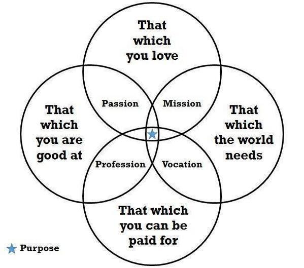
```

## Objective: Share reflections of themes in industry recruitment

```{=html}
<div class="tb title-box" style="left:53.08px;top:282.33px;width:1159.22px;height:202.29px;justify-content:flex-start;padding:12.8px 12.8px 12.8px 12.8px"><div class="tb-inner"><div class="para" style="font-size:49.78px;line-height:1.0;text-align:left">Objective: Share reflections of themes in industry recruitment</div></div></div>
```

## Outline

```{=html}
<div class="tb title-box" style="left:43.63px;top:62.3px;width:1192.73px;height:80.17px;justify-content:flex-start;padding:12.8px 12.8px 12.8px 12.8px"><div class="tb-inner"><div class="para" style="font-size:44.8px;line-height:1.0;text-align:left">Outline</div></div></div>
<div class="tb" style="left:43.63px;top:161.33px;width:1192.73px;height:478.24px;justify-content:flex-start;padding:12.8px 12.8px 12.8px 12.8px"><div class="tb-inner"><div class="para" style="font-size:32.0px;line-height:1.5;text-align:left;margin-left:64.0px;text-indent:-48.0px"><span class="bu" style="display:inline-block;width:48.0px;text-indent:0;font-size:32.0px">❖</span>What Industry</div><div class="para" style="font-size:32.0px;line-height:1.5;text-align:left;margin-left:64.0px;text-indent:-48.0px"><span class="bu" style="display:inline-block;width:48.0px;text-indent:0;font-size:32.0px">❖</span>Digital Presence</div><div class="para" style="font-size:32.0px;line-height:1.5;text-align:left;margin-left:64.0px;text-indent:-48.0px"><span class="bu" style="display:inline-block;width:48.0px;text-indent:0;font-size:32.0px">❖</span>Getting Interview Invitation </div><div class="para" style="font-size:32.0px;line-height:1.5;text-align:left;margin-left:64.0px;text-indent:-48.0px"><span class="bu" style="display:inline-block;width:48.0px;text-indent:0;font-size:32.0px">❖</span>Interview Process</div><div class="para" style="font-size:32.0px;line-height:1.5;text-align:left;margin-left:64.0px;text-indent:-48.0px"><span class="bu" style="display:inline-block;width:48.0px;text-indent:0;font-size:32.0px">❖</span>The Offer</div></div></div>
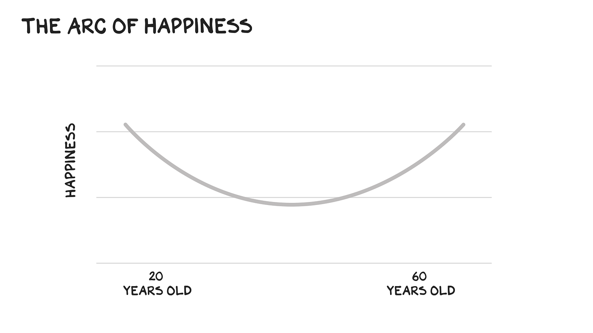
```

## What Industry

```{=html}
<div class="tb title-box" style="left:43.63px;top:301.08px;width:1192.73px;height:117.84px;justify-content:center;padding:12.8px 12.8px 12.8px 12.8px"><div class="tb-inner"><div class="para" style="font-size:64.0px;line-height:1.0;text-align:center">What Industry</div></div></div>
```

## Industry vs University / Academic Research

```{=html}
<div class="tb title-box" style="left:43.63px;top:40.96px;width:1192.73px;height:80.17px;justify-content:flex-start;padding:12.8px 12.8px 12.8px 12.8px"><div class="tb-inner"><div class="para" style="font-size:44.8px;line-height:1.0;text-align:left">Industry vs University/Academic Research</div></div></div>
<table class="deck-table" style="left:59.79px;top:142.46px;width:1160.42px"><tr><th style="width:580.21px">Academia </th><th style="width:580.21px">Industry</th></tr><tr><td style="width:580.21px">Academia is a safe privileged environment</td><td style="width:580.21px">Wide variety of organizations outside university</td></tr><tr><td style="width:580.21px">There is often time to think and explore ideas</td><td style="width:580.21px">Often there is a revenue/profit motive</td></tr><tr><td style="width:580.21px">For the most part, industry is not like that</td><td style="width:580.21px">Managers have biases and preferences</td></tr></table>
```

## Global Industry Classification Standard (GICS)

```{=html}
<div class="tb title-box" style="left:297.03px;top:13.08px;width:685.94px;height:117.84px;justify-content:center;padding:12.8px 12.8px 12.8px 12.8px"><div class="tb-inner"><div class="para" style="font-size:57.6px;line-height:1.0;text-align:center">Global Industry Classification Standard (GICS)</div></div></div>

<div class="tb" style="left:1016.34px;top:261.12px;width:188.64px;height:74.62px;justify-content:center;padding:12.8px 12.8px 12.8px 12.8px"><div class="tb-inner"><div class="para" style="font-size:24.89px;line-height:1.0;text-align:center">Materials</div></div></div>
<div class="tb" style="left:1081.74px;top:374.7px;width:188.64px;height:74.62px;justify-content:center;padding:12.8px 12.8px 12.8px 12.8px"><div class="tb-inner"><div class="para" style="font-size:24.89px;line-height:1.0;text-align:center">Industrials</div></div></div>
<div class="tb" style="left:1016.34px;top:488.29px;width:188.64px;height:74.62px;justify-content:center;padding:12.8px 12.8px 12.8px 12.8px"><div class="tb-inner"><div class="para" style="font-size:24.89px;line-height:1.0;text-align:center">Consumer discretionary</div></div></div>
<div class="tb" style="left:545.68px;top:613.98px;width:188.64px;height:74.62px;justify-content:center;padding:12.8px 12.8px 12.8px 12.8px"><div class="tb-inner"><div class="para" style="font-size:24.89px;line-height:1.0;text-align:center">Health Care</div></div></div>
<div class="tb" style="left:73.46px;top:488.29px;width:188.64px;height:74.62px;justify-content:center;padding:12.8px 12.8px 12.8px 12.8px"><div class="tb-inner"><div class="para" style="font-size:24.89px;line-height:1.0;text-align:center">Tech</div></div></div>
<div class="tb" style="left:9.63px;top:374.71px;width:188.64px;height:74.62px;justify-content:center;padding:12.8px 12.8px 12.8px 12.8px"><div class="tb-inner"><div class="para" style="font-size:24.89px;line-height:1.0;text-align:center">Communication services</div></div></div>
<div class="tb" style="left:73.46px;top:261.12px;width:188.64px;height:74.62px;justify-content:center;padding:12.8px 12.8px 12.8px 12.8px"><div class="tb-inner"><div class="para" style="font-size:24.89px;line-height:1.0;text-align:center">Utilities</div></div></div>
<div class="tb" style="left:837.01px;top:157.17px;width:188.64px;height:74.62px;justify-content:center;padding:12.8px 12.8px 12.8px 12.8px"><div class="tb-inner"><div class="para" style="font-size:24.89px;line-height:1.0;text-align:center">Energy</div></div></div>
<div class="tb" style="left:837.01px;top:592.24px;width:188.64px;height:74.62px;justify-content:center;padding:12.8px 12.8px 12.8px 12.8px"><div class="tb-inner"><div class="para" style="font-size:24.89px;line-height:1.0;text-align:center">Consumer staples</div></div></div>
<div class="tb" style="left:254.36px;top:592.24px;width:188.64px;height:74.62px;justify-content:center;padding:12.8px 12.8px 12.8px 12.8px"><div class="tb-inner"><div class="para" style="font-size:24.89px;line-height:1.0;text-align:center">Financials</div></div></div>
<div class="tb" style="left:254.36px;top:157.17px;width:188.64px;height:74.62px;justify-content:center;padding:12.8px 12.8px 12.8px 12.8px"><div class="tb-inner"><div class="para" style="font-size:24.89px;line-height:1.0;text-align:center">Real Estate</div></div></div>


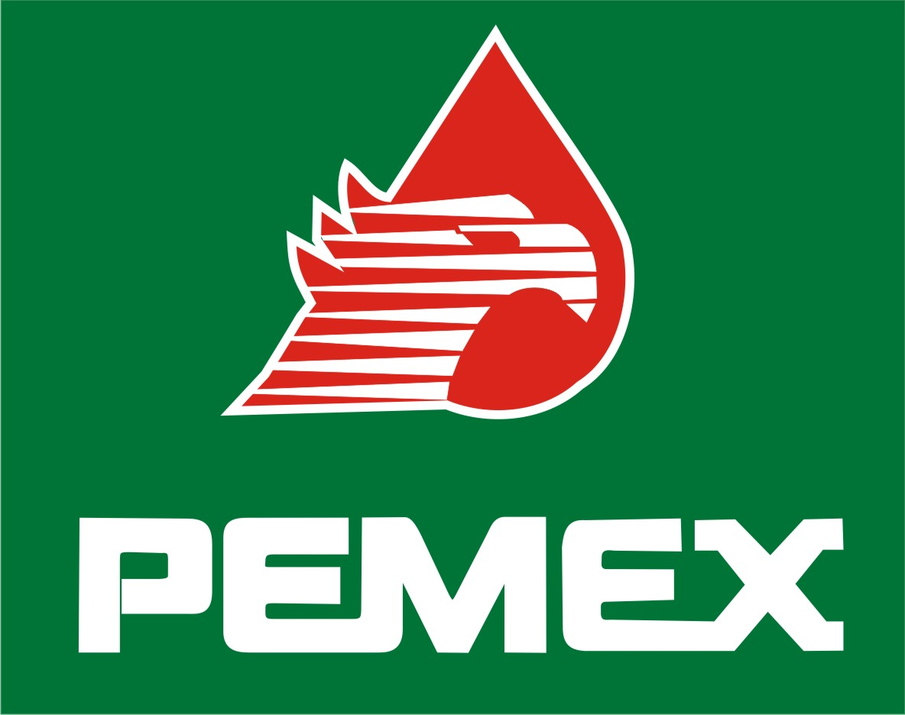


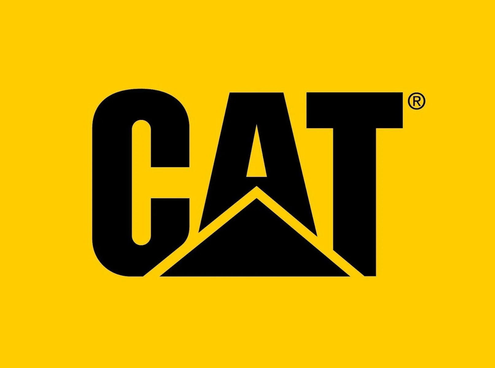


<div class="tb" style="left:500.62px;top:139.41px;width:188.64px;height:74.62px;justify-content:center;padding:12.8px 12.8px 12.8px 12.8px"><div class="tb-inner"><div class="para" style="font-size:24.89px;line-height:1.0;text-align:center">Education</div></div></div>


```

## Slide 7

```{=html}
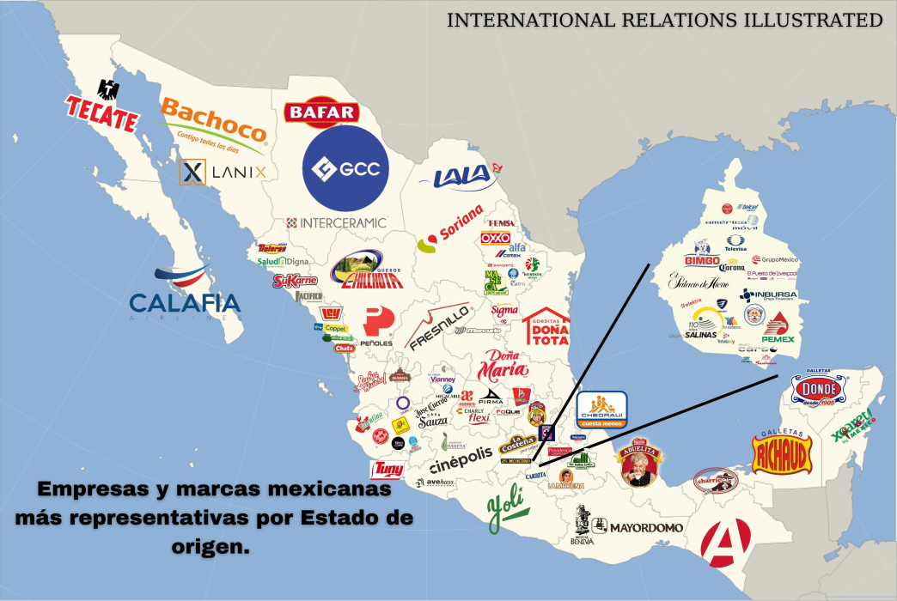
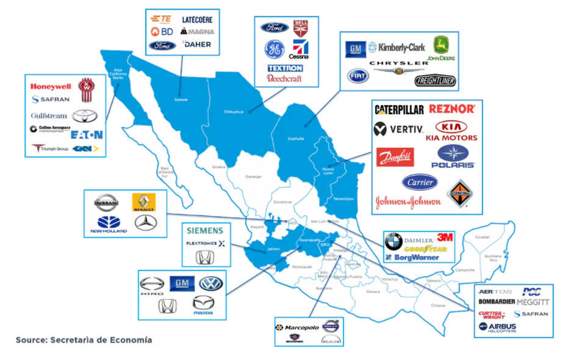
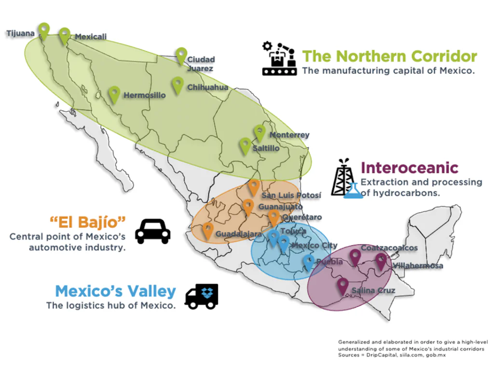
```

## Start Ups

```{=html}
<div class="tb title-box" style="left:478.65px;top:22.73px;width:288.29px;height:80.17px;justify-content:flex-start;padding:12.8px 12.8px 12.8px 12.8px"><div class="tb-inner"><div class="para" style="font-size:44.8px;line-height:1.0;text-align:left">Start Ups</div></div></div>
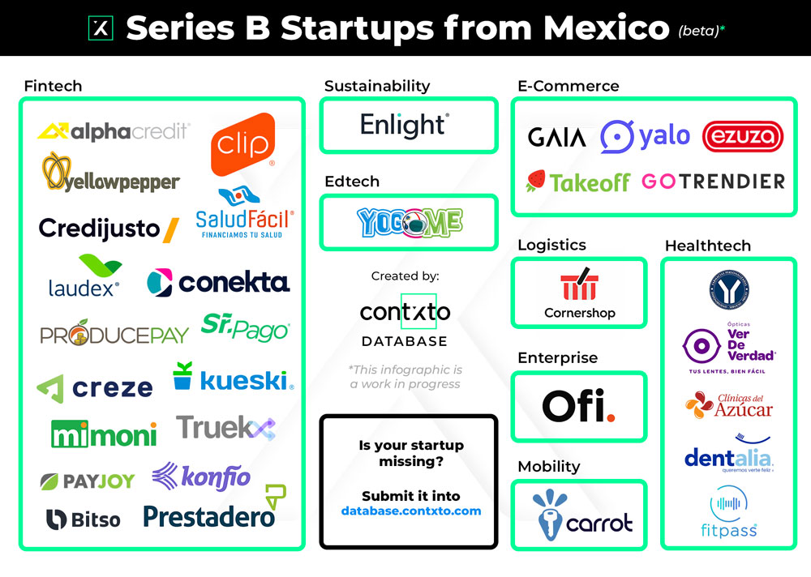
```

## Hierarchy

```{=html}
<div class="tb title-box" style="left:43.63px;top:62.3px;width:1192.73px;height:80.17px;justify-content:flex-start;padding:12.8px 12.8px 12.8px 12.8px"><div class="tb-inner"><div class="para" style="font-size:44.8px;line-height:1.0;text-align:left">Hierarchy</div></div></div>
<div class="tb" style="left:43.63px;top:161.33px;width:1192.73px;height:478.24px;justify-content:flex-start;padding:12.8px 12.8px 12.8px 12.8px"><div class="tb-inner"><div class="para" style="font-size:32.0px;line-height:1.5;text-align:left;margin-left:64.0px;text-indent:-48.0px"><span class="bu" style="display:inline-block;width:48.0px;text-indent:0;font-size:32.0px">●</span>CEO/Founder</div><div class="para" style="font-size:32.0px;line-height:1.5;text-align:left;margin-left:64.0px;text-indent:-48.0px"><span class="bu" style="display:inline-block;width:48.0px;text-indent:0;font-size:32.0px">●</span>HR/People Ops</div><div class="para" style="font-size:32.0px;line-height:1.5;text-align:left;margin-left:64.0px;text-indent:-48.0px"><span class="bu" style="display:inline-block;width:48.0px;text-indent:0;font-size:32.0px">●</span>Business Areas / Departments</div><div class="para" style="font-size:32.0px;line-height:1.5;text-align:left;margin-left:64.0px;text-indent:-48.0px"><span class="bu" style="display:inline-block;width:48.0px;text-indent:0;font-size:32.0px">●</span>Managers</div><div class="para" style="font-size:32.0px;line-height:1.5;text-align:left;margin-left:64.0px;text-indent:-48.0px"><span class="bu" style="display:inline-block;width:48.0px;text-indent:0;font-size:32.0px">●</span>Direct Manager</div><div class="para" style="font-size:32.0px;line-height:1.5;text-align:left;margin-left:64.0px;text-indent:-48.0px"><span class="bu" style="display:inline-block;width:48.0px;text-indent:0;font-size:32.0px">●</span>Team Members</div></div></div>
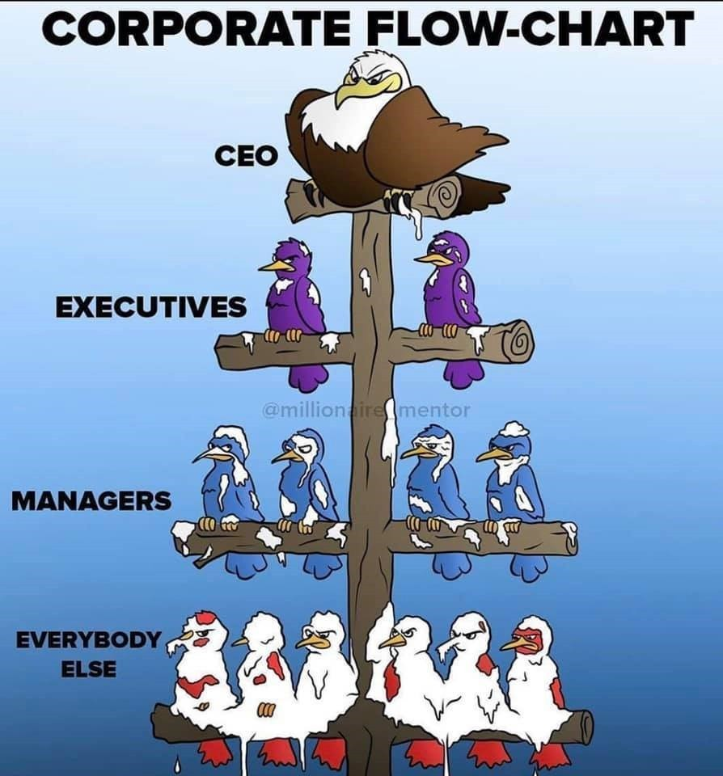
```

## Types of Organizations

```{=html}
<div class="tb title-box" style="left:43.63px;top:62.3px;width:1192.73px;height:80.17px;justify-content:flex-start;padding:12.8px 12.8px 12.8px 12.8px"><div class="tb-inner"><div class="para" style="font-size:44.8px;line-height:1.0;text-align:left">Types of Organizations</div></div></div>
<div class="tb" style="left:43.63px;top:161.33px;width:1192.73px;height:478.24px;justify-content:flex-start;padding:12.8px 12.8px 12.8px 12.8px"><div class="tb-inner"><div class="para" style="font-size:32.0px;line-height:1.5;text-align:left;margin-left:64.0px;text-indent:-48.0px"><span class="bu" style="display:inline-block;width:48.0px;text-indent:0;font-size:32.0px">❖</span>Government Agencies</div><div class="para" style="font-size:32.0px;line-height:1.5;text-align:left;margin-left:64.0px;text-indent:-48.0px"><span class="bu" style="display:inline-block;width:48.0px;text-indent:0;font-size:32.0px">❖</span>Semi Autonomous Agencies</div><div class="para" style="font-size:32.0px;line-height:1.5;text-align:left;margin-left:64.0px;text-indent:-48.0px"><span class="bu" style="display:inline-block;width:48.0px;text-indent:0;font-size:32.0px">❖</span>Low Funding Start Ups</div><div class="para" style="font-size:32.0px;line-height:1.5;text-align:left;margin-left:64.0px;text-indent:-48.0px"><span class="bu" style="display:inline-block;width:48.0px;text-indent:0;font-size:32.0px">❖</span>Small/Family Businesses</div><div class="para" style="font-size:32.0px;line-height:1.5;text-align:left;margin-left:64.0px;text-indent:-48.0px"><span class="bu" style="display:inline-block;width:48.0px;text-indent:0;font-size:32.0px">❖</span>Mid Size Businesses</div><div class="para" style="font-size:32.0px;line-height:1.5;text-align:left;margin-left:64.0px;text-indent:-48.0px"><span class="bu" style="display:inline-block;width:48.0px;text-indent:0;font-size:32.0px">❖</span>Large Companies</div><div class="para" style="font-size:32.0px;line-height:1.5;text-align:left;margin-left:64.0px;text-indent:-48.0px"><span class="bu" style="display:inline-block;width:48.0px;text-indent:0;font-size:32.0px">❖</span>Multinationals</div><div class="para" style="font-size:32.0px;line-height:1.5;text-align:left;margin-left:64.0px;text-indent:-48.0px"><span class="bu" style="display:inline-block;width:48.0px;text-indent:0;font-size:32.0px">❖</span>Well Funded Startups</div></div></div>


```

## Business Model

```{=html}
<div class="tb title-box" style="left:43.63px;top:62.3px;width:1192.73px;height:80.17px;justify-content:flex-start;padding:12.8px 12.8px 12.8px 12.8px"><div class="tb-inner"><div class="para" style="font-size:44.8px;line-height:1.0;text-align:left">Business Model</div></div></div>
<div class="tb" style="left:43.63px;top:161.33px;width:1192.73px;height:478.24px;justify-content:flex-start;padding:12.8px 12.8px 12.8px 12.8px"><div class="tb-inner"><div class="para" style="font-size:32.0px;line-height:1.5;text-align:left;margin-left:64.0px;text-indent:-48.0px"><span class="bu" style="display:inline-block;width:48.0px;text-indent:0;font-size:32.0px">❖</span>Consulting</div><div class="para" style="font-size:32.0px;line-height:1.5;text-align:left;margin-left:64.0px;text-indent:-48.0px"><span class="bu" style="display:inline-block;width:48.0px;text-indent:0;font-size:32.0px">❖</span>Product</div><div class="para" style="font-size:32.0px;line-height:1.5;text-align:left;margin-left:64.0px;text-indent:-48.0px"><span class="bu" style="display:inline-block;width:48.0px;text-indent:0;font-size:32.0px">❖</span>Platform</div><div class="para" style="font-size:32.0px;line-height:1.5;text-align:left;margin-left:64.0px;text-indent:-48.0px"><span class="bu" style="display:inline-block;width:48.0px;text-indent:0;font-size:32.0px">❖</span>Mission Driven</div></div></div>
```

## Types of Work

```{=html}
<div class="tb title-box" style="left:43.63px;top:62.3px;width:1192.73px;height:80.17px;justify-content:flex-start;padding:12.8px 12.8px 12.8px 12.8px"><div class="tb-inner"><div class="para" style="font-size:44.8px;line-height:1.0;text-align:left">Types of Work</div></div></div>
<div class="tb" style="left:43.63px;top:161.33px;width:1192.73px;height:478.24px;justify-content:flex-start;padding:12.8px 12.8px 12.8px 12.8px"><div class="tb-inner"><div class="para" style="font-size:32.0px;line-height:1.5;text-align:left;margin-left:64.0px;text-indent:-48.0px"><span class="bu" style="display:inline-block;width:48.0px;text-indent:0;font-size:32.0px">❖</span>Outside Consultant</div><div class="para" style="font-size:32.0px;line-height:1.5;text-align:left;margin-left:64.0px;text-indent:-48.0px"><span class="bu" style="display:inline-block;width:48.0px;text-indent:0;font-size:32.0px">❖</span>Temporary</div><div class="para" style="font-size:32.0px;line-height:1.5;text-align:left;margin-left:64.0px;text-indent:-48.0px"><span class="bu" style="display:inline-block;width:48.0px;text-indent:0;font-size:32.0px">❖</span>Permanent</div><div class="para" style="font-size:32.0px;line-height:1.5;text-align:left;margin-left:64.0px;text-indent:-48.0px"><span class="bu" style="display:inline-block;width:48.0px;text-indent:0;font-size:32.0px">❖</span>Full Time</div><div class="para" style="font-size:32.0px;line-height:1.5;text-align:left;margin-left:64.0px;text-indent:-48.0px"><span class="bu" style="display:inline-block;width:48.0px;text-indent:0;font-size:32.0px">❖</span>Part Time</div><div class="para" style="font-size:32.0px;line-height:1.5;text-align:left;margin-left:64.0px;text-indent:-48.0px"><span class="bu" style="display:inline-block;width:48.0px;text-indent:0;font-size:32.0px">❖</span>Remote/Hybrid/On-site</div></div></div>

```

## Types of Roles

```{=html}
<div class="tb title-box" style="left:399.55px;top:11.04px;width:364.05px;height:80.17px;justify-content:flex-start;padding:12.8px 12.8px 12.8px 12.8px"><div class="tb-inner"><div class="para" style="font-size:44.8px;line-height:1.0;text-align:left">Types of Roles</div></div></div>
<div class="tb" style="left:42.67px;top:87.14px;width:1190.51px;height:589.48px;justify-content:flex-start;padding:12.8px 12.8px 12.8px 12.8px"><div class="tb-inner"><div class="para" style="font-size:32.0px;line-height:1.05;text-align:left">Many - math graduates who can write code are popular - high endurance, abstraction, creative thinking:</div><div class="para" style="font-size:32.0px;line-height:1.05;text-align:left;margin-left:64.0px;margin-top:21.33px;text-indent:-48.0px"><span class="bu" style="display:inline-block;width:48.0px;text-indent:0;font-size:32.0px">❖</span>Data: Analyst / Engineer / Scientist / Architect</div><div class="para" style="font-size:32.0px;line-height:1.05;text-align:left;margin-left:64.0px;text-indent:-48.0px"><span class="bu" style="display:inline-block;width:48.0px;text-indent:0;font-size:32.0px">❖</span>ML: Scientist / Engineer / Consultant</div><div class="para" style="font-size:32.0px;line-height:1.05;text-align:left;margin-left:64.0px;text-indent:-48.0px"><span class="bu" style="display:inline-block;width:48.0px;text-indent:0;font-size:32.0px">❖</span>Statistician</div><div class="para" style="font-size:32.0px;line-height:1.05;text-align:left;margin-left:64.0px;text-indent:-48.0px"><span class="bu" style="display:inline-block;width:48.0px;text-indent:0;font-size:32.0px">❖</span>Bioinformatics, Biostatistics, Cheminformatics</div><div class="para" style="font-size:32.0px;line-height:1.05;text-align:left;margin-left:64.0px;text-indent:-48.0px"><span class="bu" style="display:inline-block;width:48.0px;text-indent:0;font-size:32.0px">❖</span>Computational Marketing</div><div class="para" style="font-size:32.0px;line-height:1.05;text-align:left;margin-left:64.0px;text-indent:-48.0px"><span class="bu" style="display:inline-block;width:48.0px;text-indent:0;font-size:32.0px">❖</span>Quantitative Analyst</div><div class="para" style="font-size:32.0px;line-height:1.05;text-align:left;margin-left:64.0px;text-indent:-48.0px"><span class="bu" style="display:inline-block;width:48.0px;text-indent:0;font-size:32.0px">❖</span>Software: Developer / Engineer / Architect</div><div class="para" style="font-size:32.0px;line-height:1.05;text-align:left;margin-left:64.0px;text-indent:-48.0px"><span class="bu" style="display:inline-block;width:48.0px;text-indent:0;font-size:32.0px">❖</span>Risk Analyst</div><div class="para" style="font-size:32.0px;line-height:1.05;text-align:left;margin-left:64.0px;text-indent:-48.0px"><span class="bu" style="display:inline-block;width:48.0px;text-indent:0;font-size:32.0px">❖</span>Operations Research Analyst</div><div class="para" style="font-size:32.0px;line-height:1.05;text-align:left;margin-left:64.0px;text-indent:-48.0px"><span class="bu" style="display:inline-block;width:48.0px;text-indent:0;font-size:32.0px">❖</span>Actuary</div><div class="para" style="font-size:32.0px;line-height:1.05;text-align:left;margin-left:64.0px;text-indent:-48.0px"><span class="bu" style="display:inline-block;width:48.0px;text-indent:0;font-size:32.0px">❖</span>Teacher, Professor</div></div></div>
```

## Typical Day

```{=html}
<div class="tb title-box" style="left:43.63px;top:62.3px;width:1192.73px;height:80.17px;justify-content:flex-start;padding:12.8px 12.8px 12.8px 12.8px"><div class="tb-inner"><div class="para" style="font-size:44.8px;line-height:1.0;text-align:left">Typical Day</div></div></div>
<div class="tb" style="left:43.63px;top:161.33px;width:1192.73px;height:478.24px;justify-content:flex-start;padding:12.8px 12.8px 12.8px 12.8px"><div class="tb-inner"><div class="para" style="font-size:32.0px;line-height:1.15;text-align:left;margin-left:64.0px;text-indent:-48.0px"><span class="bu" style="display:inline-block;width:48.0px;text-indent:0;font-size:32.0px">●</span>Meetings</div><div class="para" style="font-size:32.0px;line-height:1.15;text-align:left;margin-left:64.0px;text-indent:-48.0px"><span class="bu" style="display:inline-block;width:48.0px;text-indent:0;font-size:32.0px">●</span>Triaging requests on Slack</div><div class="para" style="font-size:32.0px;line-height:1.15;text-align:left;margin-left:64.0px;text-indent:-48.0px"><span class="bu" style="display:inline-block;width:48.0px;text-indent:0;font-size:32.0px">●</span>Reading research papers (specific positions)</div><div class="para" style="font-size:32.0px;line-height:1.15;text-align:left;margin-left:64.0px;text-indent:-48.0px"><span class="bu" style="display:inline-block;width:48.0px;text-indent:0;font-size:32.0px">●</span>Writing code</div><div class="para" style="font-size:32.0px;line-height:1.15;text-align:left;margin-left:64.0px;text-indent:-48.0px"><span class="bu" style="display:inline-block;width:48.0px;text-indent:0;font-size:32.0px">●</span>Sourcing data</div><div class="para" style="font-size:32.0px;line-height:1.15;text-align:left;margin-left:64.0px;text-indent:-48.0px"><span class="bu" style="display:inline-block;width:48.0px;text-indent:0;font-size:32.0px">●</span>Daily stand up (ritual: team progress, plans, updates &amp; blockers)</div><div class="para" style="font-size:32.0px;line-height:1.15;text-align:left;margin-left:64.0px;text-indent:-48.0px"><span class="bu" style="display:inline-block;width:48.0px;text-indent:0;font-size:32.0px">●</span>Training</div><div class="para" style="font-size:32.0px;line-height:1.15;text-align:left;margin-left:64.0px;text-indent:-48.0px"><span class="bu" style="display:inline-block;width:48.0px;text-indent:0;font-size:32.0px">●</span>Presentations</div><div class="para" style="font-size:32.0px;line-height:1.15;text-align:left;margin-left:64.0px;text-indent:-48.0px"><span class="bu" style="display:inline-block;width:48.0px;text-indent:0;font-size:32.0px">●</span>Demo days</div></div></div>
```

## Work Cultures

```{=html}
<div class="tb title-box" style="left:43.63px;top:62.3px;width:1192.73px;height:80.17px;justify-content:flex-start;padding:12.8px 12.8px 12.8px 12.8px"><div class="tb-inner"><div class="para" style="font-size:44.8px;line-height:1.0;text-align:left">Work Cultures</div></div></div>
<div class="tb" style="left:43.63px;top:161.33px;width:1192.73px;height:478.24px;justify-content:flex-start;padding:12.8px 12.8px 12.8px 12.8px"><div class="tb-inner"><div class="para" style="font-size:32.0px;line-height:1.15;text-align:left;margin-left:64.0px;text-indent:-48.0px"><span class="bu" style="display:inline-block;width:48.0px;text-indent:0;font-size:32.0px">❖</span>Reflective</div><div class="para" style="font-size:32.0px;line-height:1.15;text-align:left;margin-left:64.0px;text-indent:-48.0px"><span class="bu" style="display:inline-block;width:48.0px;text-indent:0;font-size:32.0px">❖</span>High Pressure</div><div class="para" style="font-size:32.0px;line-height:1.15;text-align:left;margin-left:64.0px;text-indent:-48.0px"><span class="bu" style="display:inline-block;width:48.0px;text-indent:0;font-size:32.0px">❖</span>High Performance</div><div class="para" style="font-size:32.0px;line-height:1.15;text-align:left;margin-left:64.0px;text-indent:-48.0px"><span class="bu" style="display:inline-block;width:48.0px;text-indent:0;font-size:32.0px">❖</span>Competitive, Collaborative</div><div class="para" style="font-size:32.0px;line-height:1.15;text-align:left;margin-left:64.0px;text-indent:-48.0px"><span class="bu" style="display:inline-block;width:48.0px;text-indent:0;font-size:32.0px">❖</span>Slow, Fast</div><div class="para" style="font-size:32.0px;line-height:1.15;text-align:left;margin-left:64.0px;text-indent:-48.0px"><span class="bu" style="display:inline-block;width:48.0px;text-indent:0;font-size:32.0px">❖</span>Impacting</div><div class="para" style="font-size:32.0px;line-height:1.15;text-align:left;margin-left:64.0px;text-indent:-48.0px"><span class="bu" style="display:inline-block;width:48.0px;text-indent:0;font-size:32.0px">❖</span>Toxic</div><div class="para" style="font-size:32.0px;line-height:1.15;text-align:left;margin-left:64.0px;text-indent:-48.0px"><span class="bu" style="display:inline-block;width:48.0px;text-indent:0;font-size:32.0px">❖</span>Break Things, Move Fast</div><div class="para" style="font-size:32.0px;line-height:1.15;text-align:left;margin-left:64.0px;text-indent:-48.0px"><span class="bu" style="display:inline-block;width:48.0px;text-indent:0;font-size:32.0px">❖</span>Meaningful</div><div class="para" style="font-size:32.0px;line-height:1.15;text-align:left;margin-left:64.0px;text-indent:-48.0px"><span class="bu" style="display:inline-block;width:48.0px;text-indent:0;font-size:32.0px">❖</span>Innovation, Staid</div></div></div>
```

## Devices

```{=html}
<div class="tb title-box" style="left:43.63px;top:8.96px;width:1192.73px;height:80.17px;justify-content:flex-start;padding:12.8px 12.8px 12.8px 12.8px"><div class="tb-inner"><div class="para" style="font-size:44.8px;line-height:1.0;text-align:left">Devices</div></div></div>
<div class="tb" style="left:43.63px;top:74.64px;width:1203.4px;height:604.93px;justify-content:flex-start;padding:12.8px 12.8px 12.8px 12.8px"><div class="tb-inner"><div class="para" style="font-size:29.6px;line-height:0.95;text-align:left">Laptop</div><div class="para" style="font-size:29.6px;line-height:0.95;text-align:left;margin-left:64.0px;margin-top:21.33px;text-indent:-46.8px"><span class="bu" style="display:inline-block;width:46.8px;text-indent:0;font-size:29.6px">❖</span>Data &amp; communications locked to device, everything monitored</div><div class="para" style="font-size:29.6px;line-height:0.95;text-align:left;margin-left:64.0px;text-indent:-46.8px"><span class="bu" style="display:inline-block;width:46.8px;text-indent:0;font-size:29.6px">❖</span>Traditional: business laptop with windows</div><div class="para" style="font-size:29.6px;line-height:0.95;text-align:left;margin-left:64.0px;text-indent:-46.8px"><span class="bu" style="display:inline-block;width:46.8px;text-indent:0;font-size:29.6px">❖</span>Creatives: usually provide Mac/Linux</div><div class="para" style="font-size:29.6px;line-height:0.95;text-align:left;margin-left:64.0px;text-indent:-46.8px"><span class="bu" style="display:inline-block;width:46.8px;text-indent:0;font-size:29.6px">❖</span>Take to every meeting</div><div class="para" style="font-size:29.6px;line-height:0.95;text-align:left;margin-left:64.0px;text-indent:-46.8px"><span class="bu" style="display:inline-block;width:46.8px;text-indent:0;font-size:29.6px">❖</span>Don’t open whatsapp/fb/instagram/personal email or install programs</div><div class="para" style="font-size:29.6px;line-height:0.95;text-align:left;margin-top:21.33px">Personal Phone (BYOD)</div><div class="para" style="font-size:29.6px;line-height:0.95;text-align:left;margin-left:64.0px;margin-top:21.33px;text-indent:-46.8px"><span class="bu" style="display:inline-block;width:46.8px;text-indent:0;font-size:29.6px">❖</span>Install monitoring software</div><div class="para" style="font-size:29.6px;line-height:0.95;text-align:left;margin-left:64.0px;text-indent:-46.8px"><span class="bu" style="display:inline-block;width:46.8px;text-indent:0;font-size:29.6px">❖</span>Access work docs/email/comms</div><div class="para" style="font-size:29.6px;line-height:0.95;text-align:left;margin-top:21.33px">Cloud</div><div class="para" style="font-size:29.6px;line-height:0.95;text-align:left;margin-left:64.0px;margin-top:21.33px;text-indent:-46.8px"><span class="bu" style="display:inline-block;width:46.8px;text-indent:0;font-size:29.6px">❖</span>Some legacy organizations have servers</div><div class="para" style="font-size:29.6px;line-height:0.95;text-align:left;margin-left:64.0px;text-indent:-46.8px"><span class="bu" style="display:inline-block;width:46.8px;text-indent:0;font-size:29.6px">❖</span>Organizations processing big data use cloud:</div><div class="para" style="font-size:23.02px;line-height:0.95;text-align:left;margin-left:128.0px;text-indent:-43.51px"><span class="bu" style="display:inline-block;width:43.51px;text-indent:0;font-size:23.02px">➢</span>Amazon AWS, Google GCP, Microsoft Azure, Huawei, Alibaba Cloud</div><div class="para" style="font-size:29.6px;line-height:0.95;text-align:left;margin-left:64.0px;text-indent:-46.8px"><span class="bu" style="display:inline-block;width:46.8px;text-indent:0;font-size:29.6px">❖</span>Tech &amp; start-ups are mostly using cloud</div></div></div>
```

## Communications

```{=html}
<div class="tb title-box" style="left:43.63px;top:40.96px;width:1192.73px;height:80.17px;justify-content:flex-start;padding:12.8px 12.8px 12.8px 12.8px"><div class="tb-inner"><div class="para" style="font-size:44.8px;line-height:1.0;text-align:left">Communications</div></div></div>
<div class="tb" style="left:43.63px;top:129.33px;width:1192.73px;height:478.24px;justify-content:flex-start;padding:12.8px 12.8px 12.8px 12.8px"><div class="tb-inner"><div class="para" style="font-size:32.0px;line-height:1.15;text-align:left;margin-left:64.0px;text-indent:-48.0px"><span class="bu" style="display:inline-block;width:48.0px;text-indent:0;font-size:32.0px">❖</span>Everything will be locked down and visible</div><div class="para" style="font-size:32.0px;line-height:1.15;text-align:left;margin-left:64.0px;text-indent:-48.0px"><span class="bu" style="display:inline-block;width:48.0px;text-indent:0;font-size:32.0px">❖</span>Use email/chat only for work</div><div class="para" style="font-size:32.0px;line-height:1.15;text-align:left;margin-left:64.0px;text-indent:-48.0px"><span class="bu" style="display:inline-block;width:48.0px;text-indent:0;font-size:32.0px">❖</span>DM service like Slack/Discord/Teams</div><div class="para" style="font-size:32.0px;line-height:1.15;text-align:left;margin-left:64.0px;text-indent:-48.0px"><span class="bu" style="display:inline-block;width:48.0px;text-indent:0;font-size:32.0px">❖</span>Reply quickly and professionally</div><div class="para" style="font-size:32.0px;line-height:1.15;text-align:left;margin-left:64.0px;text-indent:-48.0px"><span class="bu" style="display:inline-block;width:48.0px;text-indent:0;font-size:32.0px">❖</span>Keep communications short and business-like, not too formal</div><div class="para" style="font-size:32.0px;line-height:1.15;text-align:left;margin-left:64.0px;text-indent:-48.0px"><span class="bu" style="display:inline-block;width:48.0px;text-indent:0;font-size:32.0px">❖</span>Email is mostly for old economy companies</div><div class="para" style="font-size:32.0px;line-height:1.15;text-align:left;margin-left:64.0px;text-indent:-48.0px"><span class="bu" style="display:inline-block;width:48.0px;text-indent:0;font-size:32.0px">❖</span>Use calendar; be punctual</div></div></div>


```

## Cloud

```{=html}
<div class="tb title-box" style="left:43.63px;top:62.3px;width:1192.73px;height:80.17px;justify-content:flex-start;padding:12.8px 12.8px 12.8px 12.8px"><div class="tb-inner"><div class="para" style="font-size:44.8px;line-height:1.0;text-align:left">Cloud</div></div></div>
<div class="tb" style="left:43.63px;top:161.33px;width:1192.73px;height:478.24px;justify-content:flex-start;padding:12.8px 12.8px 12.8px 12.8px"><div class="tb-inner"><div class="para" style="font-size:32.0px;line-height:1.15;text-align:left;margin-left:64.0px;text-indent:-48.0px"><span class="bu" style="display:inline-block;width:48.0px;text-indent:0;font-size:32.0px">❖</span>Invest time</div><div class="para" style="font-size:32.0px;line-height:1.15;text-align:left;margin-left:64.0px;text-indent:-48.0px"><span class="bu" style="display:inline-block;width:48.0px;text-indent:0;font-size:32.0px">❖</span>Infinite scale SQL engines</div><div class="para" style="font-size:32.0px;line-height:1.15;text-align:left;margin-left:64.0px;text-indent:-48.0px"><span class="bu" style="display:inline-block;width:48.0px;text-indent:0;font-size:32.0px">❖</span>Highly scalable managed servers</div><div class="para" style="font-size:32.0px;line-height:1.15;text-align:left;margin-left:64.0px;text-indent:-48.0px"><span class="bu" style="display:inline-block;width:48.0px;text-indent:0;font-size:32.0px">❖</span>Deep Learning and more</div><div class="para" style="font-size:32.0px;line-height:1.15;text-align:left;margin-left:64.0px;text-indent:-48.0px"><span class="bu" style="display:inline-block;width:48.0px;text-indent:0;font-size:32.0px">❖</span>Docker + Kubernetes</div><div class="para" style="font-size:32.0px;line-height:1.15;text-align:left;margin-left:64.0px;text-indent:-48.0px"><span class="bu" style="display:inline-block;width:48.0px;text-indent:0;font-size:32.0px">❖</span>Manage Security</div></div></div>

```

## Data

```{=html}
<div class="tb title-box" style="left:43.63px;top:62.3px;width:1192.73px;height:80.17px;justify-content:flex-start;padding:12.8px 12.8px 12.8px 12.8px"><div class="tb-inner"><div class="para" style="font-size:44.8px;line-height:1.0;text-align:left">Data</div></div></div>
<div class="tb" style="left:43.63px;top:131.41px;width:1192.73px;height:532.49px;justify-content:flex-start;padding:12.8px 12.8px 12.8px 12.8px"><div class="tb-inner"><div class="para" style="font-size:32.0px;line-height:1.05;text-align:left">Small Data</div><div class="para" style="font-size:32.0px;line-height:1.05;text-align:left;margin-left:64.0px;margin-top:21.33px;text-indent:-48.0px"><span class="bu" style="display:inline-block;width:48.0px;text-indent:0;font-size:32.0px">●</span>Shared drive: KB, MB, GB data volume</div><div class="para" style="font-size:32.0px;line-height:1.05;text-align:left;margin-left:64.0px;text-indent:-48.0px"><span class="bu" style="display:inline-block;width:48.0px;text-indent:0;font-size:32.0px">●</span>Working on laptops</div><div class="para" style="font-size:32.0px;line-height:1.05;text-align:left;margin-left:64.0px;text-indent:-48.0px"><span class="bu" style="display:inline-block;width:48.0px;text-indent:0;font-size:32.0px">●</span>Legacy industry applications</div><div class="para" style="font-size:32.0px;line-height:1.05;text-align:left;margin-left:64.0px;text-indent:-48.0px"><span class="bu" style="display:inline-block;width:48.0px;text-indent:0;font-size:32.0px">●</span>Some working in Excel </div><div class="para" style="font-size:32.0px;line-height:1.05;text-align:left;margin-left:64.0px;text-indent:-48.0px"><span class="bu" style="display:inline-block;width:48.0px;text-indent:0;font-size:32.0px">●</span>xslx, tsv, csv, txt, db, sql file formats</div><div class="para" style="font-size:32.0px;line-height:1.05;text-align:left;margin-top:21.33px">Big Data</div><div class="para" style="font-size:32.0px;line-height:1.05;text-align:left;margin-left:64.0px;margin-top:21.33px;text-indent:-48.0px"><span class="bu" style="display:inline-block;width:48.0px;text-indent:0;font-size:32.0px">●</span>Cloud based storage: GB, PB, XB, YB data volume</div><div class="para" style="font-size:32.0px;line-height:1.05;text-align:left;margin-left:64.0px;text-indent:-48.0px"><span class="bu" style="display:inline-block;width:48.0px;text-indent:0;font-size:32.0px">●</span>Work with servers using Python, SQL (sometimes R, Node, Java)</div><div class="para" style="font-size:32.0px;line-height:1.05;text-align:left;margin-left:64.0px;text-indent:-48.0px"><span class="bu" style="display:inline-block;width:48.0px;text-indent:0;font-size:32.0px">●</span>Expect security to be paramount PII (Super sensitive data)</div><div class="para" style="font-size:32.0px;line-height:1.05;text-align:left;margin-left:64.0px;text-indent:-48.0px"><span class="bu" style="display:inline-block;width:48.0px;text-indent:0;font-size:32.0px">●</span>avro, parquet, orc, json, bson, fasta, fastq, sql file formats</div></div></div>
```

## Compensation

```{=html}
<div class="tb title-box" style="left:43.63px;top:62.3px;width:1192.73px;height:80.17px;justify-content:flex-start;padding:12.8px 12.8px 12.8px 12.8px"><div class="tb-inner"><div class="para" style="font-size:44.8px;line-height:1.0;text-align:left">Compensation</div></div></div>
<div class="tb" style="left:43.63px;top:161.33px;width:1192.73px;height:478.24px;justify-content:flex-start;padding:12.8px 12.8px 12.8px 12.8px"><div class="tb-inner"><div class="para" style="font-size:32.0px;line-height:1.15;text-align:left;margin-left:64.0px;text-indent:-48.0px"><span class="bu" style="display:inline-block;width:48.0px;text-indent:0;font-size:32.0px">❖</span>Salary </div><div class="para" style="font-size:32.0px;line-height:1.15;text-align:left;margin-left:64.0px;text-indent:-48.0px"><span class="bu" style="display:inline-block;width:48.0px;text-indent:0;font-size:32.0px">❖</span>Stock</div><div class="para" style="font-size:32.0px;line-height:1.15;text-align:left;margin-left:64.0px;text-indent:-48.0px"><span class="bu" style="display:inline-block;width:48.0px;text-indent:0;font-size:32.0px">❖</span>Vacations</div><div class="para" style="font-size:32.0px;line-height:1.15;text-align:left;margin-left:64.0px;text-indent:-48.0px"><span class="bu" style="display:inline-block;width:48.0px;text-indent:0;font-size:32.0px">❖</span>Perks: Massages, Relocation, Healthcare, Education/Travel Budget, Work From Home, Gifts, Food</div></div></div>
```

## Random Quiz: Juan Francisco

```{=html}
<div class="tb title-box" style="left:43.63px;top:301.08px;width:1192.73px;height:117.84px;justify-content:center;padding:12.8px 12.8px 12.8px 12.8px"><div class="tb-inner"><div class="para" style="font-size:64.0px;line-height:1.0;text-align:center">Random Quiz: Juan Francisco</div></div></div>
```

## Digital Presence

```{=html}
<div class="tb title-box" style="left:32.97px;top:258.41px;width:1192.73px;height:117.84px;justify-content:center;padding:12.8px 12.8px 12.8px 12.8px"><div class="tb-inner"><div class="para" style="font-size:64.0px;line-height:1.0;text-align:center">Digital Presence</div></div></div>
```

## LinkedIn

```{=html}
<div class="tb title-box" style="left:43.63px;top:62.3px;width:1192.73px;height:80.17px;justify-content:flex-start;padding:12.8px 12.8px 12.8px 12.8px"><div class="tb-inner"><div class="para" style="font-size:44.8px;line-height:1.0;text-align:left">LinkedIn</div></div></div>
<div class="tb" style="left:43.63px;top:160.42px;width:1192.73px;height:478.24px;justify-content:flex-start;padding:12.8px 12.8px 12.8px 12.8px"><div class="tb-inner"><div class="para" style="font-size:32.0px;line-height:1.5;text-align:left;margin-left:64.0px;text-indent:-48.0px"><span class="bu" style="display:inline-block;width:48.0px;text-indent:0;font-size:32.0px">❖</span>Clean </div><div class="para" style="font-size:32.0px;line-height:1.5;text-align:left;margin-left:64.0px;text-indent:-48.0px"><span class="bu" style="display:inline-block;width:48.0px;text-indent:0;font-size:32.0px">❖</span>Organized</div><div class="para" style="font-size:32.0px;line-height:1.5;text-align:left;margin-left:64.0px;text-indent:-48.0px"><span class="bu" style="display:inline-block;width:48.0px;text-indent:0;font-size:32.0px">❖</span>Professional</div><div class="para" style="font-size:32.0px;line-height:1.5;text-align:left;margin-left:64.0px;text-indent:-48.0px"><span class="bu" style="display:inline-block;width:48.0px;text-indent:0;font-size:32.0px">❖</span>List out skills relevant to roles that interest you</div></div></div>

```

## Professional/Portfolio Website

```{=html}
<div class="tb title-box" style="left:43.63px;top:62.3px;width:1192.73px;height:80.17px;justify-content:flex-start;padding:12.8px 12.8px 12.8px 12.8px"><div class="tb-inner"><div class="para" style="font-size:44.8px;line-height:1.0;text-align:left">Professional/Portfolio Website</div></div></div>
<div class="tb" style="left:43.63px;top:161.33px;width:1192.73px;height:478.24px;justify-content:flex-start;padding:12.8px 12.8px 12.8px 12.8px"><div class="tb-inner"><div class="para" style="font-size:32.0px;line-height:1.15;text-align:left;margin-left:64.0px;text-indent:-48.0px"><span class="bu" style="display:inline-block;width:48.0px;text-indent:0;font-size:32.0px">❖</span>Demo your projects</div><div class="para" style="font-size:32.0px;line-height:1.15;text-align:left;margin-left:64.0px;text-indent:-48.0px"><span class="bu" style="display:inline-block;width:48.0px;text-indent:0;font-size:32.0px">❖</span>Or a working app</div></div></div>
```

## GitHub

```{=html}
<div class="tb title-box" style="left:43.63px;top:62.3px;width:1192.73px;height:80.17px;justify-content:flex-start;padding:12.8px 12.8px 12.8px 12.8px"><div class="tb-inner"><div class="para" style="font-size:44.8px;line-height:1.0;text-align:left">GitHub</div></div></div>
<div class="tb" style="left:43.63px;top:161.33px;width:1192.73px;height:478.24px;justify-content:flex-start;padding:12.8px 12.8px 12.8px 12.8px"><div class="tb-inner"><div class="para" style="font-size:32.0px;line-height:1.15;text-align:left;margin-left:64.0px;text-indent:-48.0px"><span class="bu" style="display:inline-block;width:48.0px;text-indent:0;font-size:32.0px">❖</span>Only quality repos</div><div class="para" style="font-size:32.0px;line-height:1.15;text-align:left;margin-left:64.0px;text-indent:-48.0px"><span class="bu" style="display:inline-block;width:48.0px;text-indent:0;font-size:32.0px">❖</span>Repo names: use-skewer-case</div><div class="para" style="font-size:32.0px;line-height:1.15;text-align:left;margin-left:64.0px;text-indent:-48.0px"><span class="bu" style="display:inline-block;width:48.0px;text-indent:0;font-size:32.0px">❖</span>Commits should look professional</div></div></div>
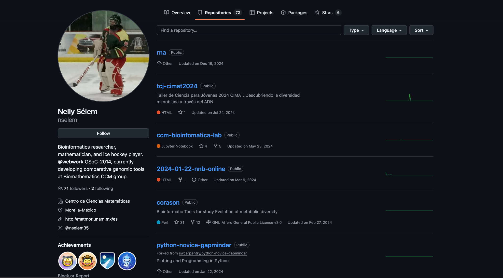
```

## Google Scholar

```{=html}
<div class="tb title-box" style="left:43.63px;top:62.3px;width:1192.73px;height:80.17px;justify-content:flex-start;padding:12.8px 12.8px 12.8px 12.8px"><div class="tb-inner"><div class="para" style="font-size:44.8px;line-height:1.0;text-align:left">Google Scholar</div></div></div>
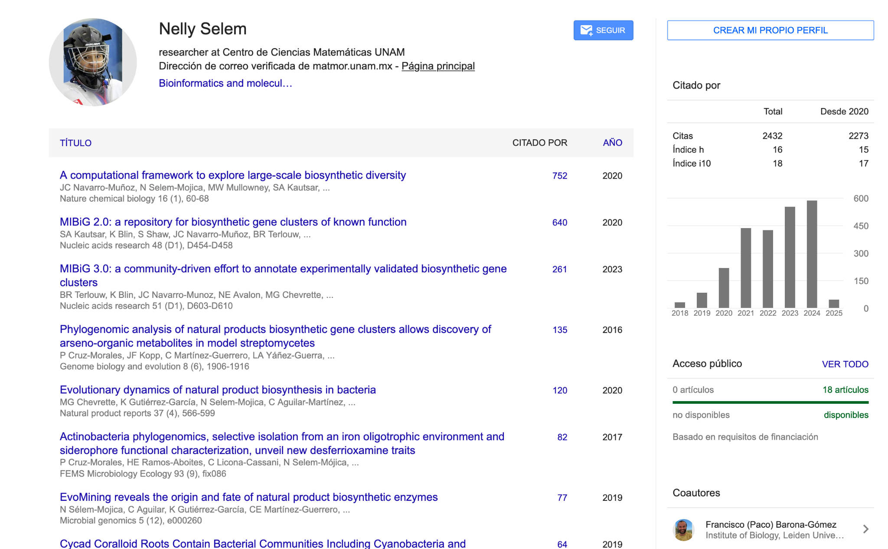
```

## ORCID

```{=html}
<div class="tb title-box" style="left:43.63px;top:62.3px;width:1192.73px;height:80.17px;justify-content:flex-start;padding:12.8px 12.8px 12.8px 12.8px"><div class="tb-inner"><div class="para" style="font-size:44.8px;line-height:1.0;text-align:left">ORCID</div></div></div>
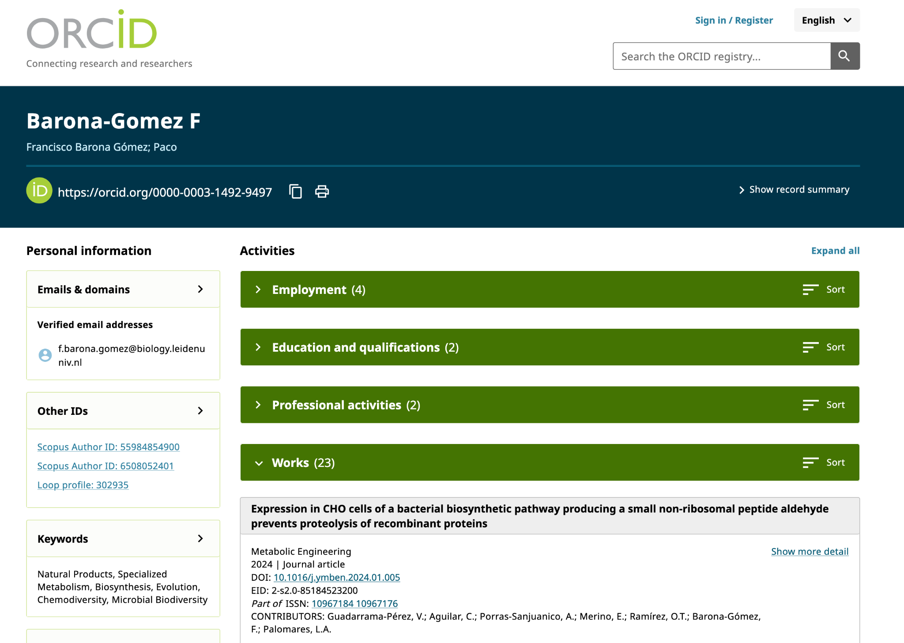
```

## Resume

```{=html}
<div class="tb title-box" style="left:43.63px;top:62.3px;width:1192.73px;height:80.17px;justify-content:flex-start;padding:12.8px 12.8px 12.8px 12.8px"><div class="tb-inner"><div class="para" style="font-size:44.8px;line-height:1.0;text-align:left">Resume</div></div></div>
<div class="tb" style="left:43.63px;top:161.33px;width:1192.73px;height:478.24px;justify-content:flex-start;padding:12.8px 12.8px 12.8px 12.8px"><div class="tb-inner"><div class="para" style="font-size:32.0px;line-height:1.15;text-align:left;margin-left:64.0px;text-indent:-48.0px"><span class="bu" style="display:inline-block;width:48.0px;text-indent:0;font-size:32.0px">❖</span>pdf format (additionally word/online)</div><div class="para" style="font-size:32.0px;line-height:1.15;text-align:left;margin-left:64.0px;text-indent:-48.0px"><span class="bu" style="display:inline-block;width:48.0px;text-indent:0;font-size:32.0px">❖</span>Have an sharable link (with a tiny url)</div><div class="para" style="font-size:32.0px;line-height:1.15;text-align:left;margin-left:64.0px;text-indent:-48.0px"><span class="bu" style="display:inline-block;width:48.0px;text-indent:0;font-size:32.0px">❖</span>1 page: usually for first screening</div><div class="para" style="font-size:32.0px;line-height:1.15;text-align:left;margin-left:64.0px;text-indent:-48.0px"><span class="bu" style="display:inline-block;width:48.0px;text-indent:0;font-size:32.0px">❖</span>2 page: when requested</div></div></div>
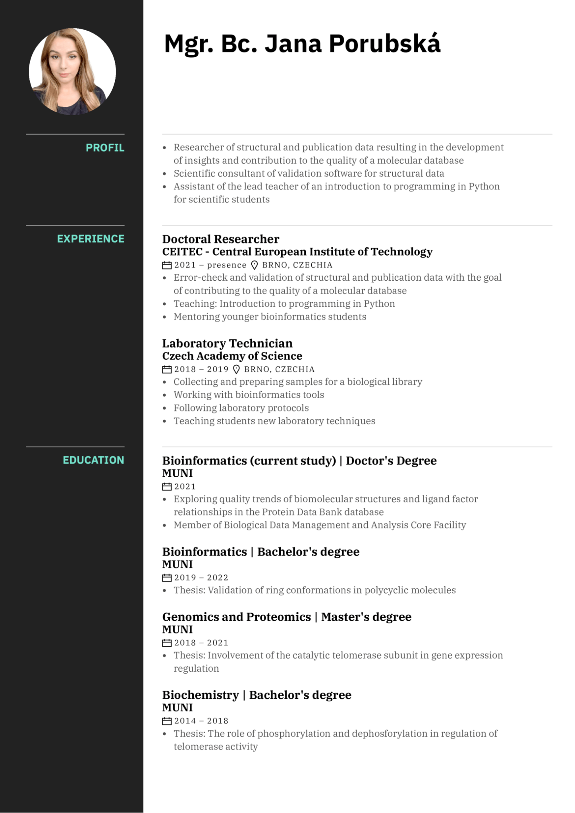
```

## Language Skills

```{=html}
<div class="tb title-box" style="left:43.63px;top:62.3px;width:1192.73px;height:80.17px;justify-content:flex-start;padding:12.8px 12.8px 12.8px 12.8px"><div class="tb-inner"><div class="para" style="font-size:44.8px;line-height:1.0;text-align:left">Language Skills</div></div></div>
<div class="tb" style="left:43.63px;top:161.33px;width:1192.73px;height:478.24px;justify-content:flex-start;padding:12.8px 12.8px 12.8px 12.8px"><div class="tb-inner"><div class="para" style="font-size:32.0px;line-height:1.15;text-align:left;margin-left:64.0px;text-indent:-48.0px"><span class="bu" style="display:inline-block;width:48.0px;text-indent:0;font-size:32.0px">❖</span>Spanish, English (English is really important for many jobs)</div><div class="para" style="font-size:32.0px;line-height:1.15;text-align:left;margin-left:64.0px;text-indent:-48.0px"><span class="bu" style="display:inline-block;width:48.0px;text-indent:0;font-size:32.0px">❖</span>Bash, Python, R, SQL, Linux</div></div></div>


```

## Application Skills

```{=html}
<div class="tb title-box" style="left:43.63px;top:62.3px;width:1192.73px;height:80.17px;justify-content:flex-start;padding:12.8px 12.8px 12.8px 12.8px"><div class="tb-inner"><div class="para" style="font-size:44.8px;line-height:1.0;text-align:left">Application Skills</div></div></div>
<div class="tb" style="left:43.63px;top:161.33px;width:1192.73px;height:478.24px;justify-content:flex-start;padding:12.8px 12.8px 12.8px 12.8px"><div class="tb-inner"><div class="para" style="font-size:32.0px;line-height:1.15;text-align:left;margin-left:64.0px;text-indent:-48.0px"><span class="bu" style="display:inline-block;width:48.0px;text-indent:0;font-size:32.0px">❖</span>Windows, Microsoft Office (Excel, Word, etc.)</div><div class="para" style="font-size:32.0px;line-height:1.15;text-align:left;margin-left:64.0px;text-indent:-48.0px"><span class="bu" style="display:inline-block;width:48.0px;text-indent:0;font-size:32.0px">❖</span>Google App (Drive, Sheets, Slides, Docs)</div><div class="para" style="font-size:32.0px;line-height:1.15;text-align:left;margin-left:64.0px;text-indent:-48.0px"><span class="bu" style="display:inline-block;width:48.0px;text-indent:0;font-size:32.0px">❖</span>LLM: ChatGPT/Gemini/Claude</div></div></div>

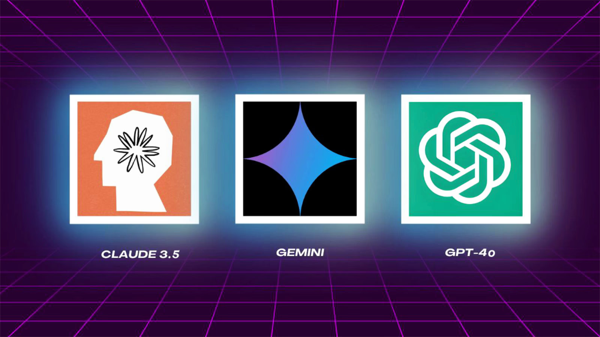
```

## Getting Interview Invitation

```{=html}
<div class="tb title-box" style="left:43.63px;top:301.08px;width:1192.73px;height:117.84px;justify-content:center;padding:12.8px 12.8px 12.8px 12.8px"><div class="tb-inner"><div class="para" style="font-size:64.0px;line-height:1.0;text-align:center">Getting Interview Invitation </div></div></div>
```

## Hiring: Organization Perspective

```{=html}
<div class="tb title-box" style="left:43.63px;top:62.3px;width:1192.73px;height:80.17px;justify-content:flex-start;padding:12.8px 12.8px 12.8px 12.8px"><div class="tb-inner"><div class="para" style="font-size:44.8px;line-height:1.0;text-align:left">Hiring: Organization Perspective</div></div></div>
<div class="tb" style="left:43.63px;top:161.33px;width:1192.73px;height:478.24px;justify-content:flex-start;padding:12.8px 12.8px 12.8px 12.8px"><div class="tb-inner"><div class="para" style="font-size:32.0px;line-height:1.15;text-align:left;margin-left:64.0px;text-indent:-48.0px"><span class="bu" style="display:inline-block;width:48.0px;text-indent:0;font-size:32.0px">❖</span>Time is money</div><div class="para" style="font-size:32.0px;line-height:1.15;text-align:left;margin-left:64.0px;text-indent:-48.0px"><span class="bu" style="display:inline-block;width:48.0px;text-indent:0;font-size:32.0px">❖</span>Can cost 5-15% of the total budget, 30% of first year salary, 200% to replace a bad hire</div><div class="para" style="font-size:32.0px;line-height:1.15;text-align:left;margin-left:64.0px;text-indent:-48.0px"><span class="bu" style="display:inline-block;width:48.0px;text-indent:0;font-size:32.0px">❖</span>Productivity declines</div><div class="para" style="font-size:32.0px;line-height:1.15;text-align:left;margin-left:64.0px;text-indent:-48.0px"><span class="bu" style="display:inline-block;width:48.0px;text-indent:0;font-size:32.0px">❖</span>Too many online applications</div><div class="para" style="font-size:32.0px;line-height:1.15;text-align:left;margin-left:64.0px;text-indent:-48.0px"><span class="bu" style="display:inline-block;width:48.0px;text-indent:0;font-size:32.0px">❖</span>Filtering is error prone</div><div class="para" style="font-size:32.0px;line-height:1.15;text-align:left;margin-left:64.0px;text-indent:-48.0px"><span class="bu" style="display:inline-block;width:48.0px;text-indent:0;font-size:32.0px">❖</span>Bad hires are a weight on the organization</div><div class="para" style="font-size:32.0px;line-height:1.15;text-align:left;margin-left:64.0px;text-indent:-48.0px"><span class="bu" style="display:inline-block;width:48.0px;text-indent:0;font-size:32.0px">❖</span>Boring &amp; exhausting process</div><div class="para" style="font-size:32.0px;line-height:1.15;text-align:left;margin-left:64.0px;text-indent:-48.0px"><span class="bu" style="display:inline-block;width:48.0px;text-indent:0;font-size:32.0px">❖</span>Serious candidates need to demonstrate motivation</div></div></div>
```

## Opinions

```{=html}
<div class="tb title-box" style="left:43.63px;top:62.3px;width:1192.73px;height:80.17px;justify-content:flex-start;padding:12.8px 12.8px 12.8px 12.8px"><div class="tb-inner"><div class="para" style="font-size:44.8px;line-height:1.0;text-align:left">Opinions</div></div></div>
<div class="tb" style="left:43.63px;top:161.33px;width:1192.73px;height:478.24px;justify-content:flex-start;padding:12.8px 12.8px 12.8px 12.8px"><div class="tb-inner"><div class="para" style="font-size:32.0px;line-height:1.5;text-align:left;margin-left:64.0px;text-indent:-48.0px"><span class="bu" style="display:inline-block;width:48.0px;text-indent:0;font-size:32.0px">❖</span>Learn to work in groups of 2-5 people, ideally cross functional teams</div><div class="para" style="font-size:32.0px;line-height:1.5;text-align:left;margin-left:64.0px;text-indent:-48.0px"><span class="bu" style="display:inline-block;width:48.0px;text-indent:0;font-size:32.0px">❖</span>Many organizations work on quarterly budgets and allocations</div><div class="para" style="font-size:32.0px;line-height:1.5;text-align:left;margin-left:64.0px;text-indent:-48.0px"><span class="bu" style="display:inline-block;width:48.0px;text-indent:0;font-size:32.0px">❖</span>Could apply around the quarters (Dec/Jan, March/April, June/July, Sept/Oct)</div><div class="para" style="font-size:32.0px;line-height:1.5;text-align:left;margin-left:64.0px;text-indent:-48.0px"><span class="bu" style="display:inline-block;width:48.0px;text-indent:0;font-size:32.0px">❖</span>Probably best to get to a big city, you’ll learn more quickly working with highly skilled people</div><div class="para" style="font-size:32.0px;line-height:1.5;text-align:left;margin-left:64.0px;text-indent:-48.0px"><span class="bu" style="display:inline-block;width:48.0px;text-indent:0;font-size:32.0px">❖</span>Live close to work for the first year (even if it’s a small apartment share)</div><div class="para" style="font-size:32.0px;line-height:1.5;text-align:left;margin-left:64.0px;text-indent:-48.0px"><span class="bu" style="display:inline-block;width:48.0px;text-indent:0;font-size:32.0px">❖</span>Work crazy hard for the first 6 months</div><div class="para" style="font-size:32.0px;line-height:1.5;text-align:left;margin-left:64.0px;text-indent:-48.0px"><span class="bu" style="display:inline-block;width:48.0px;text-indent:0;font-size:32.0px">❖</span>Don’t mention you want to go back to university (PhD/Masters)</div></div></div>
```

## Networking

```{=html}
<div class="tb title-box" style="left:43.63px;top:62.3px;width:1192.73px;height:80.17px;justify-content:flex-start;padding:12.8px 12.8px 12.8px 12.8px"><div class="tb-inner"><div class="para" style="font-size:44.8px;line-height:1.0;text-align:left">Networking</div></div></div>
<div class="tb" style="left:43.63px;top:161.33px;width:1192.73px;height:478.24px;justify-content:flex-start;padding:12.8px 12.8px 12.8px 12.8px"><div class="tb-inner"><div class="para" style="font-size:32.0px;line-height:1.15;text-align:left">High Probability of Interview:</div><div class="para" style="font-size:32.0px;line-height:1.15;text-align:left;margin-left:64.0px;margin-top:21.33px;text-indent:-48.0px"><span class="bu" style="display:inline-block;width:48.0px;text-indent:0;font-size:32.0px">❖</span>Friends</div><div class="para" style="font-size:32.0px;line-height:1.15;text-align:left;margin-left:64.0px;text-indent:-48.0px"><span class="bu" style="display:inline-block;width:48.0px;text-indent:0;font-size:32.0px">❖</span>Family</div><div class="para" style="font-size:32.0px;line-height:1.15;text-align:left;margin-left:64.0px;text-indent:-48.0px"><span class="bu" style="display:inline-block;width:48.0px;text-indent:0;font-size:32.0px">❖</span>Conferences</div><div class="para" style="font-size:32.0px;line-height:1.15;text-align:left;margin-left:64.0px;text-indent:-48.0px"><span class="bu" style="display:inline-block;width:48.0px;text-indent:0;font-size:32.0px">❖</span>LinkedIn coffee meetings with potential colleagues</div><div class="para" style="font-size:32.0px;line-height:1.15;text-align:left;margin-left:64.0px;text-indent:-48.0px"><span class="bu" style="display:inline-block;width:48.0px;text-indent:0;font-size:32.0px">❖</span>Not fair, but filtering is expensive and boring</div></div></div>
```

## Candidate Qualities

```{=html}
<div class="tb title-box" style="left:43.63px;top:62.3px;width:1192.73px;height:80.17px;justify-content:flex-start;padding:12.8px 12.8px 12.8px 12.8px"><div class="tb-inner"><div class="para" style="font-size:44.8px;line-height:1.0;text-align:left">Candidate Qualities</div></div></div>
<div class="tb" style="left:43.63px;top:161.33px;width:1192.73px;height:478.24px;justify-content:flex-start;padding:12.8px 12.8px 12.8px 12.8px"><div class="tb-inner"><div class="para" style="font-size:32.0px;line-height:1.3;text-align:left;margin-left:64.0px;text-indent:-49.77px"><span class="bu" style="display:inline-block;width:49.77px;text-indent:0;font-size:35.56px">❖</span>Be nice (your prospective colleagues will spend more time with you than their partner)</div><div class="para" style="font-size:32.0px;line-height:1.3;text-align:left;margin-left:64.0px;text-indent:-49.77px"><span class="bu" style="display:inline-block;width:49.77px;text-indent:0;font-size:35.56px">❖</span>Don’t be nervous or desperate</div><div class="para" style="font-size:32.0px;line-height:1.3;text-align:left;margin-left:64.0px;text-indent:-49.77px"><span class="bu" style="display:inline-block;width:49.77px;text-indent:0;font-size:35.56px">❖</span>Don’t boast</div><div class="para" style="font-size:32.0px;line-height:1.3;text-align:left;margin-left:64.0px;text-indent:-49.77px"><span class="bu" style="display:inline-block;width:49.77px;text-indent:0;font-size:35.56px">❖</span>Listen carefully, speak slowly</div><div class="para" style="font-size:32.0px;line-height:1.3;text-align:left;margin-left:64.0px;text-indent:-49.77px"><span class="bu" style="display:inline-block;width:49.77px;text-indent:0;font-size:35.56px">❖</span>Go to office if possible</div></div></div>
```

## Types of Recruiters

```{=html}
<div class="tb title-box" style="left:43.63px;top:62.3px;width:1192.73px;height:80.17px;justify-content:flex-start;padding:12.8px 12.8px 12.8px 12.8px"><div class="tb-inner"><div class="para" style="font-size:44.8px;line-height:1.0;text-align:left">Types of Recruiters</div></div></div>
<div class="tb" style="left:43.63px;top:161.33px;width:1192.73px;height:478.24px;justify-content:flex-start;padding:12.8px 12.8px 12.8px 12.8px"><div class="tb-inner"><div class="para" style="font-size:32.0px;line-height:1.15;text-align:left;margin-left:64.0px;text-indent:-48.0px"><span class="bu" style="display:inline-block;width:48.0px;text-indent:0;font-size:32.0px">❖</span>External (not ideal - will eat into your compensation - maybe 30%)</div><div class="para" style="font-size:32.0px;line-height:1.15;text-align:left;margin-left:64.0px;text-indent:-48.0px"><span class="bu" style="display:inline-block;width:48.0px;text-indent:0;font-size:32.0px">❖</span>Internal</div><div class="para" style="font-size:32.0px;line-height:1.15;text-align:left;margin-left:64.0px;text-indent:-48.0px"><span class="bu" style="display:inline-block;width:48.0px;text-indent:0;font-size:32.0px">❖</span>Semi-internal (contracted by business)</div></div></div>
```

## LinkedIn/Indeed

```{=html}
<div class="tb title-box" style="left:43.63px;top:19.63px;width:1192.73px;height:80.17px;justify-content:flex-start;padding:12.8px 12.8px 12.8px 12.8px"><div class="tb-inner"><div class="para" style="font-size:44.8px;line-height:1.0;text-align:left">LinkedIn/Indeed</div></div></div>
<div class="tb" style="left:33.17px;top:121.13px;width:1203.19px;height:518.43px;justify-content:flex-start;padding:12.8px 12.8px 12.8px 12.8px"><div class="tb-inner"><div class="para" style="font-size:32.0px;line-height:1.15;text-align:left;margin-bottom:21.33px">Don’t apply for jobs directly</div></div></div>

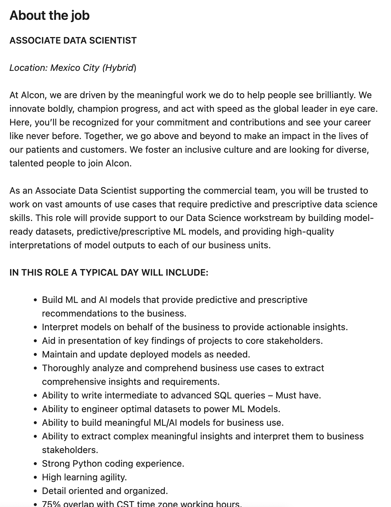
```

## Job Description

```{=html}
<div class="tb title-box" style="left:43.63px;top:62.3px;width:1192.73px;height:80.17px;justify-content:flex-start;padding:12.8px 12.8px 12.8px 12.8px"><div class="tb-inner"><div class="para" style="font-size:44.8px;line-height:1.0;text-align:left">Job Description</div></div></div>
<div class="tb" style="left:43.63px;top:161.33px;width:1192.73px;height:478.24px;justify-content:flex-start;padding:12.8px 12.8px 12.8px 12.8px"><div class="tb-inner"><div class="para" style="font-size:32.0px;line-height:1.15;text-align:left;margin-left:64.0px;text-indent:-48.0px"><span class="bu" style="display:inline-block;width:48.0px;text-indent:0;font-size:32.0px">❖</span>Don’t worry</div><div class="para" style="font-size:32.0px;line-height:1.15;text-align:left;margin-left:64.0px;text-indent:-48.0px"><span class="bu" style="display:inline-block;width:48.0px;text-indent:0;font-size:32.0px">❖</span>Only a guide (sometimes a senior post, will consider a good junior)</div><div class="para" style="font-size:32.0px;line-height:1.15;text-align:left;margin-left:64.0px;text-indent:-48.0px"><span class="bu" style="display:inline-block;width:48.0px;text-indent:0;font-size:32.0px">❖</span>Often copy/pasted by HR</div><div class="para" style="font-size:32.0px;line-height:1.15;text-align:left;margin-left:64.0px;text-indent:-48.0px"><span class="bu" style="display:inline-block;width:48.0px;text-indent:0;font-size:32.0px">❖</span>No one completes all the requirements</div><div class="para" style="font-size:32.0px;line-height:1.15;text-align:left;margin-left:64.0px;text-indent:-48.0px"><span class="bu" style="display:inline-block;width:48.0px;text-indent:0;font-size:32.0px">❖</span>Work out if the position is in a cost center or revenue driver for the business</div></div></div>
```

## Tailored Resume

```{=html}
<div class="tb title-box" style="left:43.63px;top:62.3px;width:1192.73px;height:80.17px;justify-content:flex-start;padding:12.8px 12.8px 12.8px 12.8px"><div class="tb-inner"><div class="para" style="font-size:44.8px;line-height:1.0;text-align:left">Tailored Resume</div></div></div>
<div class="tb" style="left:43.63px;top:161.33px;width:1192.73px;height:478.24px;justify-content:flex-start;padding:12.8px 12.8px 12.8px 12.8px"><div class="tb-inner"><div class="para" style="font-size:32.0px;line-height:1.15;text-align:left;margin-left:64.0px;text-indent:-48.0px"><span class="bu" style="display:inline-block;width:48.0px;text-indent:0;font-size:32.0px">❖</span>Make the resume fit the job</div><div class="para" style="font-size:32.0px;line-height:1.15;text-align:left;margin-left:64.0px;text-indent:-48.0px"><span class="bu" style="display:inline-block;width:48.0px;text-indent:0;font-size:32.0px">❖</span>Highlight skills relevant to the jobs</div><div class="para" style="font-size:32.0px;line-height:1.15;text-align:left;margin-left:64.0px;text-indent:-48.0px"><span class="bu" style="display:inline-block;width:48.0px;text-indent:0;font-size:32.0px">❖</span>Remove skills not relevant</div></div></div>
```

## Direct Approach

```{=html}
<div class="tb title-box" style="left:43.63px;top:62.3px;width:1192.73px;height:80.17px;justify-content:flex-start;padding:12.8px 12.8px 12.8px 12.8px"><div class="tb-inner"><div class="para" style="font-size:44.8px;line-height:1.0;text-align:left">Direct Approach</div></div></div>
<div class="tb" style="left:32.97px;top:184.48px;width:662.72px;height:478.24px;justify-content:flex-start;padding:12.8px 12.8px 12.8px 12.8px"><div class="tb-inner"><div class="para" style="font-size:32.0px;line-height:1.15;text-align:left">Google then write to the internal recruiter</div><div class="para" style="font-size:32.0px;line-height:1.15;text-align:left;margin-top:21.33px"><span style="font-weight:bold">Write to googled prospective colleagues (LinkedIn, BlueSky, X, Mastodon)</span></div></div></div>


```

## ATS: Automated Tracking Software

```{=html}
<div class="tb title-box" style="left:43.63px;top:62.3px;width:1192.73px;height:80.17px;justify-content:flex-start;padding:12.8px 12.8px 12.8px 12.8px"><div class="tb-inner"><div class="para" style="font-size:44.8px;line-height:1.0;text-align:left">ATS: Automated Tracking Software</div></div></div>
<div class="tb" style="left:43.63px;top:139.99px;width:1192.73px;height:478.24px;justify-content:flex-start;padding:12.8px 12.8px 12.8px 12.8px"><div class="tb-inner"><div class="para" style="font-size:32.0px;line-height:1.15;text-align:left;margin-left:64.0px;text-indent:-48.0px"><span class="bu" style="display:inline-block;width:48.0px;text-indent:0;font-size:32.0px">❖</span>Most platforms have ATS software</div><div class="para" style="font-size:32.0px;line-height:1.15;text-align:left;margin-left:64.0px;text-indent:-48.0px"><span class="bu" style="display:inline-block;width:48.0px;text-indent:0;font-size:32.0px">❖</span>This is a <span style="font-weight:bold;text-decoration:underline">classifier</span></div><div class="para" style="font-size:32.0px;line-height:1.15;text-align:left;margin-left:64.0px;text-indent:-48.0px"><span class="bu" style="display:inline-block;width:48.0px;text-indent:0;font-size:32.0px">❖</span>It filters on experience, universities, age, keywords, companies etc</div><div class="para" style="font-size:32.0px;line-height:1.15;text-align:left;margin-left:64.0px;text-indent:-48.0px"><span class="bu" style="display:inline-block;width:48.0px;text-indent:0;font-size:32.0px">❖</span>Write to internal recruiters directly, write to prospective colleagues</div></div></div>

```

## Technical Screening: Mariel

```{=html}
<div class="tb title-box" style="left:43.63px;top:301.08px;width:1192.73px;height:117.84px;justify-content:center;padding:12.8px 12.8px 12.8px 12.8px"><div class="tb-inner"><div class="para" style="font-size:64.0px;line-height:1.0;text-align:center">Technical Screening: Mariel</div></div></div>
```

## Invited Interview Process

```{=html}
<div class="tb title-box" style="left:43.63px;top:301.08px;width:1192.73px;height:117.84px;justify-content:center;padding:12.8px 12.8px 12.8px 12.8px"><div class="tb-inner"><div class="para" style="font-size:64.0px;line-height:1.0;text-align:center">Invited Interview Process</div></div></div>
```

## Understand the Organization

```{=html}
<div class="tb title-box" style="left:43.63px;top:62.3px;width:1192.73px;height:80.17px;justify-content:flex-start;padding:12.8px 12.8px 12.8px 12.8px"><div class="tb-inner"><div class="para" style="font-size:44.8px;line-height:1.0;text-align:left">Understand the Organization</div></div></div>
<div class="tb" style="left:43.63px;top:161.33px;width:1192.73px;height:478.24px;justify-content:flex-start;padding:12.8px 12.8px 12.8px 12.8px"><div class="tb-inner"><div class="para" style="font-size:32.0px;line-height:1.15;text-align:left;margin-left:64.0px;text-indent:-48.0px"><span class="bu" style="display:inline-block;width:48.0px;text-indent:0;font-size:32.0px">❖</span>Understand their business model</div><div class="para" style="font-size:32.0px;line-height:1.15;text-align:left;margin-left:64.0px;text-indent:-48.0px"><span class="bu" style="display:inline-block;width:48.0px;text-indent:0;font-size:32.0px">❖</span>Know sector themes</div><div class="para" style="font-size:32.0px;line-height:1.15;text-align:left;margin-left:64.0px;text-indent:-48.0px"><span class="bu" style="display:inline-block;width:48.0px;text-indent:0;font-size:32.0px">❖</span>Industry press</div><div class="para" style="font-size:32.0px;line-height:1.15;text-align:left;margin-left:64.0px;text-indent:-48.0px"><span class="bu" style="display:inline-block;width:48.0px;text-indent:0;font-size:32.0px">❖</span>CEO/CFO/CTO/Prospective Colleagues Interviews/Posts</div><div class="para" style="font-size:32.0px;line-height:1.15;text-align:left;margin-left:64.0px;text-indent:-48.0px"><span class="bu" style="display:inline-block;width:48.0px;text-indent:0;font-size:32.0px">❖</span>Understand revenue/profit/cost sources of the organization</div></div></div>
```

## Your Persona

```{=html}
<div class="tb title-box" style="left:43.63px;top:62.3px;width:1192.73px;height:80.17px;justify-content:flex-start;padding:12.8px 12.8px 12.8px 12.8px"><div class="tb-inner"><div class="para" style="font-size:44.8px;line-height:1.0;text-align:left">Your Persona</div></div></div>
<div class="tb" style="left:43.63px;top:161.33px;width:1192.73px;height:462.19px;justify-content:flex-start;padding:12.8px 12.8px 12.8px 12.8px"><div class="tb-inner"><div class="para" style="font-size:32.0px;line-height:1.15;text-align:left;margin-left:64.0px;text-indent:-48.0px"><span class="bu" style="display:inline-block;width:48.0px;text-indent:0;font-size:32.0px">❖</span>Smile (Lots)</div><div class="para" style="font-size:32.0px;line-height:1.15;text-align:left;margin-left:64.0px;text-indent:-48.0px"><span class="bu" style="display:inline-block;width:48.0px;text-indent:0;font-size:32.0px">❖</span>Positive energy</div><div class="para" style="font-size:32.0px;line-height:1.15;text-align:left;margin-left:64.0px;text-indent:-48.0px"><span class="bu" style="display:inline-block;width:48.0px;text-indent:0;font-size:32.0px">❖</span>Confident, can do attitude</div><div class="para" style="font-size:32.0px;line-height:1.15;text-align:left;margin-left:64.0px;text-indent:-48.0px"><span class="bu" style="display:inline-block;width:48.0px;text-indent:0;font-size:32.0px">❖</span>Professionally attractive version of yourself</div><div class="para" style="font-size:32.0px;line-height:1.15;text-align:left;margin-left:64.0px;text-indent:-48.0px"><span class="bu" style="display:inline-block;width:48.0px;text-indent:0;font-size:32.0px">❖</span>Dress code depends on industry sector</div><div class="para" style="font-size:24.89px;line-height:1.15;text-align:left;margin-left:128.0px;text-indent:-44.44px"><span class="bu" style="display:inline-block;width:44.44px;text-indent:0;font-size:24.89px">➢</span>Traditional (Law, Finance, Govt, University): Conservative dress, hide tattoos, piercings</div><div class="para" style="font-size:24.89px;line-height:1.15;text-align:left;margin-left:128.0px;text-indent:-44.44px"><span class="bu" style="display:inline-block;width:44.44px;text-indent:0;font-size:24.89px">➢</span>Creative (Tech, Media, Arts, Startups): More permissive on self-expression</div></div></div>
```

## Interviewers Team

```{=html}
<div class="tb title-box" style="left:43.63px;top:62.3px;width:1192.73px;height:80.17px;justify-content:flex-start;padding:12.8px 12.8px 12.8px 12.8px"><div class="tb-inner"><div class="para" style="font-size:44.8px;line-height:1.0;text-align:left">Interviewers Team</div></div></div>
<div class="tb" style="left:43.63px;top:153.13px;width:1212.14px;height:420.33px;justify-content:flex-start;padding:12.8px 12.8px 12.8px 12.8px"><div class="tb-inner"><div class="para" style="font-size:32.0px;line-height:1.15;text-align:left;margin-left:64.0px;text-indent:-48.0px"><span class="bu" style="display:inline-block;width:48.0px;text-indent:0;font-size:32.0px">❖</span><span style="font-weight:bold;text-decoration:underline">People Ops (HR)</span></div><div class="para" style="font-size:24.89px;line-height:1.15;text-align:left;margin-left:128.0px;text-indent:-44.44px"><span class="bu" style="display:inline-block;width:44.44px;text-indent:0;font-size:24.89px">➢</span>Senior</div><div class="para" style="font-size:24.89px;line-height:1.15;text-align:left;margin-left:128.0px;text-indent:-44.44px"><span class="bu" style="display:inline-block;width:44.44px;text-indent:0;font-size:24.89px">➢</span>Junior</div><div class="para" style="font-size:32.0px;line-height:1.15;text-align:left;margin-left:64.0px;text-indent:-48.0px"><span class="bu" style="display:inline-block;width:48.0px;text-indent:0;font-size:32.0px">❖</span><span style="font-weight:bold;text-decoration:underline">Team Members</span></div><div class="para" style="font-size:24.89px;line-height:1.15;text-align:left;margin-left:128.0px;text-indent:-44.44px"><span class="bu" style="display:inline-block;width:44.44px;text-indent:0;font-size:24.89px">➢</span>Business Area Manager</div><div class="para" style="font-size:24.89px;line-height:1.15;text-align:left;margin-left:128.0px;text-indent:-44.44px"><span class="bu" style="display:inline-block;width:44.44px;text-indent:0;font-size:24.89px">➢</span>Hiring Manager</div><div class="para" style="font-size:24.89px;line-height:1.15;text-align:left;margin-left:128.0px;text-indent:-44.44px"><span class="bu" style="display:inline-block;width:44.44px;text-indent:0;font-size:24.89px">➢</span>Second Manager</div><div class="para" style="font-size:32.0px;line-height:1.15;text-align:left;margin-left:64.0px;text-indent:-48.0px"><span class="bu" style="display:inline-block;width:48.0px;text-indent:0;font-size:32.0px">❖</span><span style="font-weight:bold;text-decoration:underline">Random Business Areas</span></div><div class="para" style="font-size:24.89px;line-height:1.15;text-align:left;margin-left:128.0px;text-indent:-44.44px"><span class="bu" style="display:inline-block;width:44.44px;text-indent:0;font-size:24.89px">➢</span>Random jr to check fit with culture</div><div class="para" style="font-size:24.89px;line-height:1.15;text-align:left;margin-left:128.0px;text-indent:-44.44px"><span class="bu" style="display:inline-block;width:44.44px;text-indent:0;font-size:24.89px">➢</span>Random Manager to check fit with culture</div></div></div>
```

## Recruitment Process

```{=html}
<div class="tb title-box" style="left:43.63px;top:62.3px;width:1192.73px;height:80.17px;justify-content:flex-start;padding:12.8px 12.8px 12.8px 12.8px"><div class="tb-inner"><div class="para" style="font-size:44.8px;line-height:1.0;text-align:left">Recruitment Process</div></div></div>
<div class="tb" style="left:43.63px;top:161.33px;width:1192.73px;height:478.24px;justify-content:flex-start;padding:12.8px 12.8px 12.8px 12.8px"><div class="tb-inner"><div class="para" style="font-size:32.0px;line-height:1.15;text-align:left;margin-left:64.0px;text-indent:-48.0px"><span class="bu" style="display:inline-block;width:48.0px;text-indent:0;font-size:32.0px">❖</span>First Stage Screening</div><div class="para" style="font-size:32.0px;line-height:1.15;text-align:left;margin-left:64.0px;text-indent:-48.0px"><span class="bu" style="display:inline-block;width:48.0px;text-indent:0;font-size:32.0px">❖</span>Second Stage Screening</div><div class="para" style="font-size:32.0px;line-height:1.15;text-align:left;margin-left:64.0px;text-indent:-48.0px"><span class="bu" style="display:inline-block;width:48.0px;text-indent:0;font-size:32.0px">❖</span>Technical Screening</div><div class="para" style="font-size:32.0px;line-height:1.15;text-align:left;margin-left:64.0px;text-indent:-48.0px"><span class="bu" style="display:inline-block;width:48.0px;text-indent:0;font-size:32.0px">❖</span>Interview Panel</div><div class="para" style="font-size:32.0px;line-height:1.15;text-align:left;margin-left:64.0px;text-indent:-48.0px"><span class="bu" style="display:inline-block;width:48.0px;text-indent:0;font-size:32.0px">❖</span>Technical Interview</div></div></div>
```

## First Screen: HR Interview

```{=html}
<div class="tb title-box" style="left:43.63px;top:62.3px;width:1192.73px;height:80.17px;justify-content:flex-start;padding:12.8px 12.8px 12.8px 12.8px"><div class="tb-inner"><div class="para" style="font-size:44.8px;line-height:1.0;text-align:left">First Screen: HR Interview</div></div></div>
<div class="tb" style="left:43.63px;top:161.33px;width:1192.73px;height:478.24px;justify-content:flex-start;padding:12.8px 12.8px 12.8px 12.8px"><div class="tb-inner"><div class="para" style="font-size:32.0px;line-height:1.15;text-align:left;margin-left:64.0px;text-indent:-48.0px"><span class="bu" style="display:inline-block;width:48.0px;text-indent:0;font-size:32.0px">❖</span>Check candidate is suitable and realistic</div><div class="para" style="font-size:32.0px;line-height:1.15;text-align:left;margin-left:64.0px;text-indent:-48.0px"><span class="bu" style="display:inline-block;width:48.0px;text-indent:0;font-size:32.0px">❖</span>Filter out completely unaware</div></div></div>
```

## Follow Up Call/Email

```{=html}
<div class="tb title-box" style="left:43.63px;top:62.3px;width:1192.73px;height:80.17px;justify-content:flex-start;padding:12.8px 12.8px 12.8px 12.8px"><div class="tb-inner"><div class="para" style="font-size:44.8px;line-height:1.0;text-align:left">Follow Up Call/Email</div></div></div>
<div class="tb" style="left:43.63px;top:150.66px;width:1192.73px;height:478.24px;justify-content:flex-start;padding:12.8px 12.8px 12.8px 12.8px"><div class="tb-inner"><div class="para" style="font-size:32.0px;line-height:1.15;text-align:left;margin-left:64.0px;text-indent:-48.0px"><span class="bu" style="display:inline-block;width:48.0px;text-indent:0;font-size:32.0px">❖</span>Very important</div><div class="para" style="font-size:32.0px;line-height:1.15;text-align:left;margin-left:64.0px;text-indent:-48.0px"><span class="bu" style="display:inline-block;width:48.0px;text-indent:0;font-size:32.0px">❖</span>Send a polite email thanking the interviewer(s) for taking the time to interview you</div><div class="para" style="font-size:32.0px;line-height:1.15;text-align:left;margin-left:64.0px;text-indent:-48.0px"><span class="bu" style="display:inline-block;width:48.0px;text-indent:0;font-size:32.0px">❖</span>Do this for after every interview - make sure to write to all interviewers</div><div class="para" style="font-size:32.0px;line-height:1.15;text-align:left;margin-left:64.0px;text-indent:-48.0px"><span class="bu" style="display:inline-block;width:48.0px;text-indent:0;font-size:32.0px">❖</span>Many can fail at this stage</div></div></div>
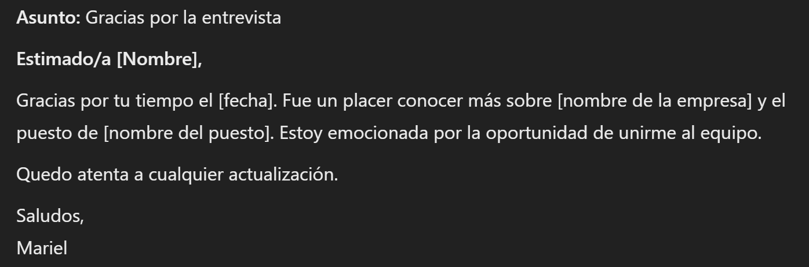
```

## Second Screen: Small Technical Challenge

```{=html}
<div class="tb title-box" style="left:43.63px;top:62.3px;width:1192.73px;height:80.17px;justify-content:flex-start;padding:12.8px 12.8px 12.8px 12.8px"><div class="tb-inner"><div class="para" style="font-size:44.8px;line-height:1.0;text-align:left">Second Screen: Small Technical Challenge</div></div></div>
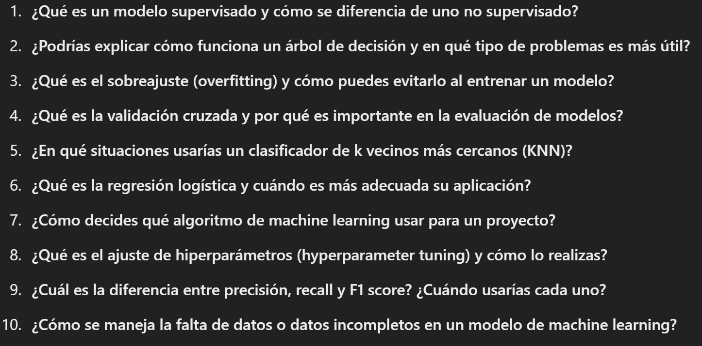
```

## Interview Panel

```{=html}
<div class="tb title-box" style="left:43.63px;top:62.3px;width:1192.73px;height:80.17px;justify-content:flex-start;padding:12.8px 12.8px 12.8px 12.8px"><div class="tb-inner"><div class="para" style="font-size:44.8px;line-height:1.0;text-align:left">Interview Panel </div></div></div>
<div class="tb" style="left:43.63px;top:161.33px;width:1192.73px;height:478.24px;justify-content:flex-start;padding:12.8px 12.8px 12.8px 12.8px"><div class="tb-inner"><div class="para" style="font-size:32.0px;line-height:1.15;text-align:left;margin-left:64.0px;text-indent:-48.0px"><span class="bu" style="display:inline-block;width:48.0px;text-indent:0;font-size:32.0px">❖</span>0.5-3 days</div><div class="para" style="font-size:32.0px;line-height:1.15;text-align:left;margin-left:64.0px;text-indent:-48.0px"><span class="bu" style="display:inline-block;width:48.0px;text-indent:0;font-size:32.0px">❖</span>On-site at the office (Could be off-site at a hotel/resort)</div><div class="para" style="font-size:32.0px;line-height:1.15;text-align:left;margin-left:64.0px;text-indent:-48.0px"><span class="bu" style="display:inline-block;width:48.0px;text-indent:0;font-size:32.0px">❖</span>5-8 interviews with 2-3 interviewers in each interview</div></div></div>
```

## Interviews: Interview Panel

```{=html}
<div class="tb title-box" style="left:43.63px;top:62.3px;width:1192.73px;height:80.17px;justify-content:flex-start;padding:12.8px 12.8px 12.8px 12.8px"><div class="tb-inner"><div class="para" style="font-size:44.8px;line-height:1.0;text-align:left">Interviews: Interview Panel</div></div></div>
<div class="tb" style="left:43.63px;top:161.33px;width:1192.73px;height:478.24px;justify-content:flex-start;padding:12.8px 12.8px 12.8px 12.8px"><div class="tb-inner"><div class="para" style="font-size:32.0px;line-height:1.15;text-align:left;margin-left:64.0px;text-indent:-48.0px"><span class="bu" style="display:inline-block;width:48.0px;text-indent:0;font-size:32.0px">❖</span>Introduce yourself, small talk about weather, journey </div><div class="para" style="font-size:32.0px;line-height:1.15;text-align:left;margin-left:64.0px;text-indent:-48.0px"><span class="bu" style="display:inline-block;width:48.0px;text-indent:0;font-size:32.0px">❖</span>If asked, mention you have other interviews in process</div><div class="para" style="font-size:32.0px;line-height:1.15;text-align:left;margin-left:64.0px;text-indent:-48.0px"><span class="bu" style="display:inline-block;width:48.0px;text-indent:0;font-size:32.0px">❖</span>Wide ranging types (group, in-tray, interaction)</div><div class="para" style="font-size:32.0px;line-height:1.15;text-align:left;margin-left:64.0px;text-indent:-48.0px"><span class="bu" style="display:inline-block;width:48.0px;text-indent:0;font-size:32.0px">❖</span>Related to job</div><div class="para" style="font-size:32.0px;line-height:1.15;text-align:left;margin-left:64.0px;text-indent:-48.0px"><span class="bu" style="display:inline-block;width:48.0px;text-indent:0;font-size:32.0px">❖</span>Show enthusiasm for the mission of the organization</div><div class="para" style="font-size:32.0px;line-height:1.15;text-align:left;margin-left:64.0px;text-indent:-48.0px"><span class="bu" style="display:inline-block;width:48.0px;text-indent:0;font-size:32.0px">❖</span>Smile lots</div><div class="para" style="font-size:32.0px;line-height:1.15;text-align:left;margin-left:64.0px;text-indent:-48.0px"><span class="bu" style="display:inline-block;width:48.0px;text-indent:0;font-size:32.0px">❖</span>It’s not an academic free thinking environment</div></div></div>
```

## Psychometrics

```{=html}
<div class="tb title-box" style="left:43.63px;top:21.34px;width:1192.73px;height:80.17px;justify-content:flex-start;padding:12.8px 12.8px 12.8px 12.8px"><div class="tb-inner"><div class="para" style="font-size:44.8px;line-height:1.0;text-align:left">Psychometrics</div></div></div>
<div class="tb" style="left:43.63px;top:103.51px;width:1192.73px;height:544.88px;justify-content:flex-start;padding:12.8px 12.8px 12.8px 12.8px"><div class="tb-inner"><div class="para" style="font-size:32.0px;line-height:1.15;text-align:left"><span style="font-weight:bold;text-decoration:underline">Personality</span><span style="font-weight:bold;text-decoration:underline"> Test</span></div><div class="para" style="font-size:32.0px;line-height:1.15;text-align:left;margin-left:64.0px;margin-top:21.33px;text-indent:-48.0px"><span class="bu" style="display:inline-block;width:48.0px;text-indent:0;font-size:32.0px">❖</span>Try to give middle response </div><div class="para" style="font-size:32.0px;line-height:1.15;text-align:left;margin-left:64.0px;text-indent:-48.0px"><span class="bu" style="display:inline-block;width:48.0px;text-indent:0;font-size:32.0px">❖</span>Usually not very important</div><div class="para" style="font-size:32.0px;line-height:1.15;text-align:left;margin-top:21.33px"><span style="font-weight:bold;text-decoration:underline">Aptitude Test</span></div><div class="para" style="font-size:32.0px;line-height:1.15;text-align:left;margin-left:64.0px;margin-top:21.33px;text-indent:-48.0px"><span class="bu" style="display:inline-block;width:48.0px;text-indent:0;font-size:32.0px">❖</span>Looking at repetitive baseline skills</div><div class="para" style="font-size:32.0px;line-height:1.15;text-align:left;margin-left:64.0px;text-indent:-48.0px"><span class="bu" style="display:inline-block;width:48.0px;text-indent:0;font-size:32.0px">❖</span>Could be important for specific roles</div><div class="para" style="font-size:32.0px;line-height:1.15;text-align:left;margin-left:64.0px;text-indent:-48.0px"><span class="bu" style="display:inline-block;width:48.0px;text-indent:0;font-size:32.0px">❖</span>Not good for creative positions</div></div></div>
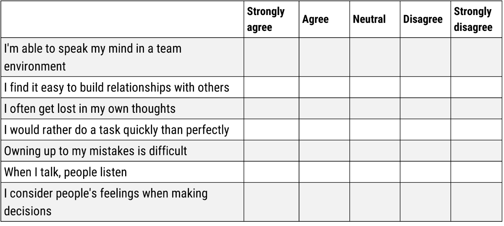
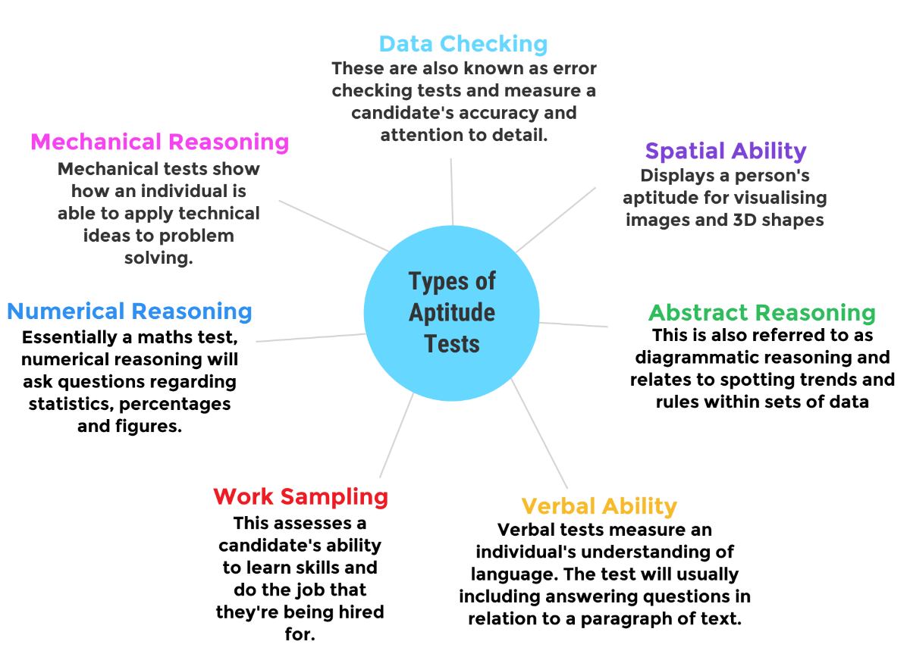
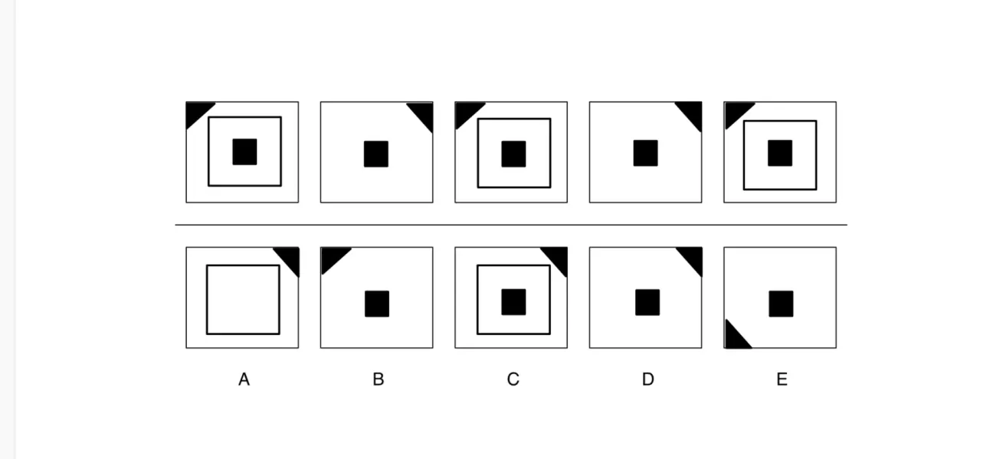
```

## Technical Coding Interview

```{=html}
<div class="tb title-box" style="left:43.63px;top:62.3px;width:1192.73px;height:80.17px;justify-content:flex-start;padding:12.8px 12.8px 12.8px 12.8px"><div class="tb-inner"><div class="para" style="font-size:44.8px;line-height:1.0;text-align:left">Technical Coding Interview</div></div></div>
<div class="tb" style="left:43.63px;top:161.33px;width:1192.73px;height:478.24px;justify-content:flex-start;padding:12.8px 12.8px 12.8px 12.8px"><div class="tb-inner"><div class="para" style="font-size:32.0px;line-height:1.15;text-align:left;margin-left:64.0px;text-indent:-48.0px"><span class="bu" style="display:inline-block;width:48.0px;text-indent:0;font-size:32.0px">❖</span>Can practice hundreds online (people do: <a href="http://leetcode.com" style="text-decoration:underline">leetcode.com</a>, <a href="http://hackerrank.com" style="text-decoration:underline">hackerank.com</a>)</div><div class="para" style="font-size:32.0px;line-height:1.15;text-align:left;margin-left:64.0px;text-indent:-48.0px"><span class="bu" style="display:inline-block;width:48.0px;text-indent:0;font-size:32.0px">❖</span>Pattern matching</div><div class="para" style="font-size:32.0px;line-height:1.15;text-align:left;margin-left:64.0px;text-indent:-48.0px"><span class="bu" style="display:inline-block;width:48.0px;text-indent:0;font-size:32.0px">❖</span>Watch YouTube for examples</div><div class="para" style="font-size:32.0px;line-height:1.15;text-align:left;margin-left:64.0px;text-indent:-48.0px"><span class="bu" style="display:inline-block;width:48.0px;text-indent:0;font-size:32.0px">❖</span>Big-O, Loops, Recursion, Conditionals</div><div class="para" style="font-size:32.0px;line-height:1.15;text-align:left;margin-left:64.0px;text-indent:-48.0px"><span class="bu" style="display:inline-block;width:48.0px;text-indent:0;font-size:32.0px">❖</span>Programming Style</div></div></div>
```

## Technical Interview: Mariel

```{=html}
<div class="tb title-box" style="left:22.3px;top:301.08px;width:1192.73px;height:117.84px;justify-content:center;padding:12.8px 12.8px 12.8px 12.8px"><div class="tb-inner"><div class="para" style="font-size:64.0px;line-height:1.0;text-align:center">Technical Interview: Mariel</div></div></div>
```

## The Rejection

```{=html}
<div class="tb title-box" style="left:43.63px;top:301.08px;width:1192.73px;height:117.84px;justify-content:center;padding:12.8px 12.8px 12.8px 12.8px"><div class="tb-inner"><div class="para" style="font-size:64.0px;line-height:1.0;text-align:center">The Rejection</div></div></div>
```

## Rejection

```{=html}
<div class="tb title-box" style="left:43.63px;top:62.3px;width:1192.73px;height:80.17px;justify-content:flex-start;padding:12.8px 12.8px 12.8px 12.8px"><div class="tb-inner"><div class="para" style="font-size:44.8px;line-height:1.0;text-align:left">Rejection</div></div></div>
<div class="tb" style="left:43.63px;top:161.33px;width:1192.73px;height:478.24px;justify-content:flex-start;padding:12.8px 12.8px 12.8px 12.8px"><div class="tb-inner"><div class="para" style="font-size:32.0px;line-height:1.15;text-align:left;margin-left:64.0px;text-indent:-48.0px"><span class="bu" style="display:inline-block;width:48.0px;text-indent:0;font-size:32.0px">❖</span>Slow response (days to weeks)</div><div class="para" style="font-size:32.0px;line-height:1.15;text-align:left;margin-left:64.0px;text-indent:-48.0px"><span class="bu" style="display:inline-block;width:48.0px;text-indent:0;font-size:32.0px">❖</span>Don’t take it personally</div><div class="para" style="font-size:32.0px;line-height:1.15;text-align:left;margin-left:64.0px;text-indent:-48.0px"><span class="bu" style="display:inline-block;width:48.0px;text-indent:0;font-size:32.0px">❖</span>Many reasons</div><div class="para" style="font-size:24.89px;line-height:1.15;text-align:left;margin-left:128.0px;text-indent:-44.44px"><span class="bu" style="display:inline-block;width:44.44px;text-indent:0;font-size:24.89px">➢</span>Bad Organization Fit</div><div class="para" style="font-size:24.89px;line-height:1.15;text-align:left;margin-left:128.0px;text-indent:-44.44px"><span class="bu" style="display:inline-block;width:44.44px;text-indent:0;font-size:24.89px">➢</span>Funding Withdrawn</div><div class="para" style="font-size:24.89px;line-height:1.15;text-align:left;margin-left:128.0px;text-indent:-44.44px"><span class="bu" style="display:inline-block;width:44.44px;text-indent:0;font-size:24.89px">➢</span>Better Candidate</div><div class="para" style="font-size:24.89px;line-height:1.15;text-align:left;margin-left:128.0px;text-indent:-44.44px"><span class="bu" style="display:inline-block;width:44.44px;text-indent:0;font-size:24.89px">➢</span>Internal Candidate</div><div class="para" style="font-size:24.89px;line-height:1.15;text-align:left;margin-left:128.0px;text-indent:-44.44px"><span class="bu" style="display:inline-block;width:44.44px;text-indent:0;font-size:24.89px">➢</span>Poor performance</div></div></div>
```

## Feedback

```{=html}
<div class="tb title-box" style="left:43.63px;top:62.3px;width:1192.73px;height:80.17px;justify-content:flex-start;padding:12.8px 12.8px 12.8px 12.8px"><div class="tb-inner"><div class="para" style="font-size:44.8px;line-height:1.0;text-align:left">Feedback</div></div></div>
<div class="tb" style="left:43.63px;top:161.33px;width:1192.73px;height:478.24px;justify-content:flex-start;padding:12.8px 12.8px 12.8px 12.8px"><div class="tb-inner"><div class="para" style="font-size:32.0px;line-height:1.15;text-align:left;margin-left:64.0px;text-indent:-48.0px"><span class="bu" style="display:inline-block;width:48.0px;text-indent:0;font-size:32.0px">❖</span>Valuable</div><div class="para" style="font-size:32.0px;line-height:1.15;text-align:left;margin-left:64.0px;text-indent:-48.0px"><span class="bu" style="display:inline-block;width:48.0px;text-indent:0;font-size:32.0px">❖</span>Try to get specifics</div><div class="para" style="font-size:32.0px;line-height:1.15;text-align:left;margin-left:64.0px;text-indent:-48.0px"><span class="bu" style="display:inline-block;width:48.0px;text-indent:0;font-size:32.0px">❖</span>Suggestions for how to improve</div><div class="para" style="font-size:32.0px;line-height:1.15;text-align:left;margin-left:64.0px;text-indent:-48.0px"><span class="bu" style="display:inline-block;width:48.0px;text-indent:0;font-size:32.0px">❖</span>Be grateful</div></div></div>
```

## The Offer

```{=html}
<div class="tb title-box" style="left:22.3px;top:301.08px;width:1192.73px;height:117.84px;justify-content:center;padding:12.8px 12.8px 12.8px 12.8px"><div class="tb-inner"><div class="para" style="font-size:64.0px;line-height:1.0;text-align:center">The Offer</div></div></div>
```

## Offer Process

```{=html}
<div class="tb title-box" style="left:43.63px;top:62.3px;width:1192.73px;height:80.17px;justify-content:flex-start;padding:12.8px 12.8px 12.8px 12.8px"><div class="tb-inner"><div class="para" style="font-size:44.8px;line-height:1.0;text-align:left">Offer Process</div></div></div>
<div class="tb" style="left:43.63px;top:161.33px;width:1192.73px;height:478.24px;justify-content:flex-start;padding:12.8px 12.8px 12.8px 12.8px"><div class="tb-inner"><div class="para" style="font-size:32.0px;line-height:1.15;text-align:left;margin-left:64.0px;text-indent:-48.0px"><span class="bu" style="display:inline-block;width:48.0px;text-indent:0;font-size:32.0px">❖</span>Fast Response (Hours to Days)</div><div class="para" style="font-size:32.0px;line-height:1.15;text-align:left;margin-left:64.0px;text-indent:-48.0px"><span class="bu" style="display:inline-block;width:48.0px;text-indent:0;font-size:32.0px">❖</span>Informal call/email from HR</div><div class="para" style="font-size:32.0px;line-height:1.15;text-align:left;margin-left:64.0px;text-indent:-48.0px"><span class="bu" style="display:inline-block;width:48.0px;text-indent:0;font-size:32.0px">❖</span>Subject to offer, accept provisionally if you like the organization</div><div class="para" style="font-size:32.0px;line-height:1.15;text-align:left;margin-left:64.0px;text-indent:-48.0px"><span class="bu" style="display:inline-block;width:48.0px;text-indent:0;font-size:32.0px">❖</span>Formal offer: can be a zoom with all interviewers</div><div class="para" style="font-size:32.0px;line-height:1.15;text-align:left;margin-left:64.0px;text-indent:-48.0px"><span class="bu" style="display:inline-block;width:48.0px;text-indent:0;font-size:32.0px">❖</span>Try to Negotiate</div></div></div>
```

## Offer  Negotiation

```{=html}
<div class="tb title-box" style="left:43.63px;top:62.3px;width:1192.73px;height:80.17px;justify-content:flex-start;padding:12.8px 12.8px 12.8px 12.8px"><div class="tb-inner"><div class="para" style="font-size:44.8px;line-height:1.0;text-align:left">Offer Negotiation</div></div></div>
<div class="tb" style="left:43.63px;top:161.33px;width:1192.73px;height:478.24px;justify-content:flex-start;padding:12.8px 12.8px 12.8px 12.8px"><div class="tb-inner"><div class="para" style="font-size:32.0px;line-height:1.15;text-align:left;margin-left:64.0px;text-indent:-48.0px"><span class="bu" style="display:inline-block;width:48.0px;text-indent:0;font-size:32.0px">❖</span>10-30% increase possible</div><div class="para" style="font-size:32.0px;line-height:1.15;text-align:left;margin-left:64.0px;text-indent:-48.0px"><span class="bu" style="display:inline-block;width:48.0px;text-indent:0;font-size:32.0px">❖</span>stock/salary/sign-on bonus/vacation/other benefits</div><div class="para" style="font-size:32.0px;line-height:1.15;text-align:left;margin-left:64.0px;text-indent:-48.0px"><span class="bu" style="display:inline-block;width:48.0px;text-indent:0;font-size:32.0px">❖</span>startup stock options mostly don’t work out</div><div class="para" style="font-size:32.0px;line-height:1.15;text-align:left;margin-left:64.0px;text-indent:-48.0px"><span class="bu" style="display:inline-block;width:48.0px;text-indent:0;font-size:32.0px">❖</span>Often the improvement is stock or relocation costs (might not be worth much)</div></div></div>
```

```{=html}
<script>
// PowerPoint's "shrink text on overflow": scale any text box whose text is
// taller than its original box, so it can never spill over the shapes around
// it. Boxes are measured only while their slide is on screen, because
// reveal.js hides the others and they would measure as zero.
(function () {
  function fitSlide(section) {
    if (!section) return;
    section.querySelectorAll('.tb').forEach(function (tb) {
      var inner = tb.querySelector('.tb-inner');
      if (!inner) return;
      inner.style.transform = '';
      inner.style.height = '';
      if (!tb.clientHeight) return;
      var cs = getComputedStyle(tb);
      var avail = tb.clientHeight - parseFloat(cs.paddingTop) - parseFloat(cs.paddingBottom);
      var needed = inner.scrollHeight;
      if (avail > 0 && needed > avail + 1) {
        inner.style.transform = 'scale(' + (avail / needed) + ')';
        // A transform does not change layout size, so a vertically centred
        // box would still be positioned on the unscaled height and spill.
        // Pinning the height to what is actually drawn keeps it anchored.
        inner.style.height = avail + 'px';
      }
    });
  }
  function hook() {
    if (typeof Reveal === 'undefined' || !Reveal.on) return false;
    var run = function () {
      var go = function () { fitSlide(Reveal.getCurrentSlide()); };
      go();
      // Re-measure once webfonts settle, since metrics can shift.
      if (document.fonts && document.fonts.ready) document.fonts.ready.then(go);
    };
    Reveal.on('ready', run);
    Reveal.on('slidechanged', run);
    Reveal.on('resize', run);
    if (Reveal.isReady && Reveal.isReady()) run();
    return true;
  }
  if (!hook()) {
    window.addEventListener('load', function () {
      if (!hook()) setTimeout(hook, 500);
    });
  }
})();
</script>
```
